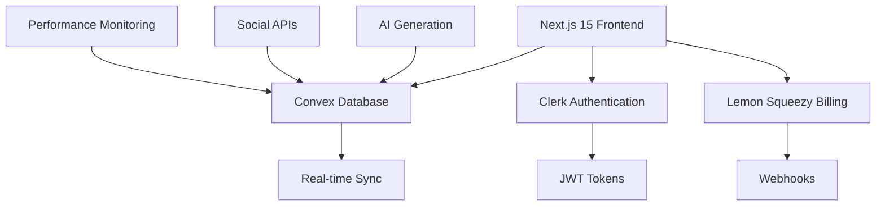
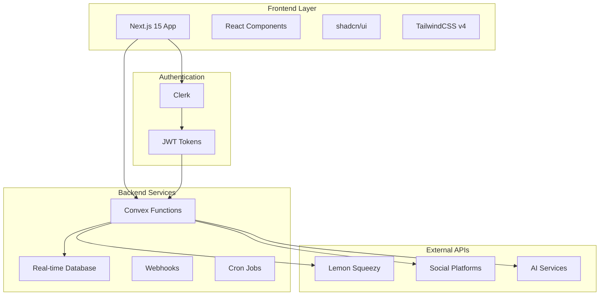
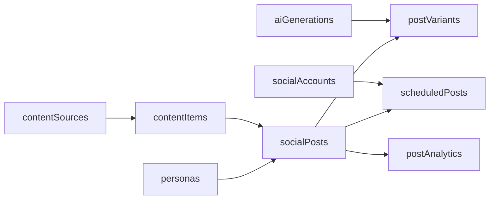
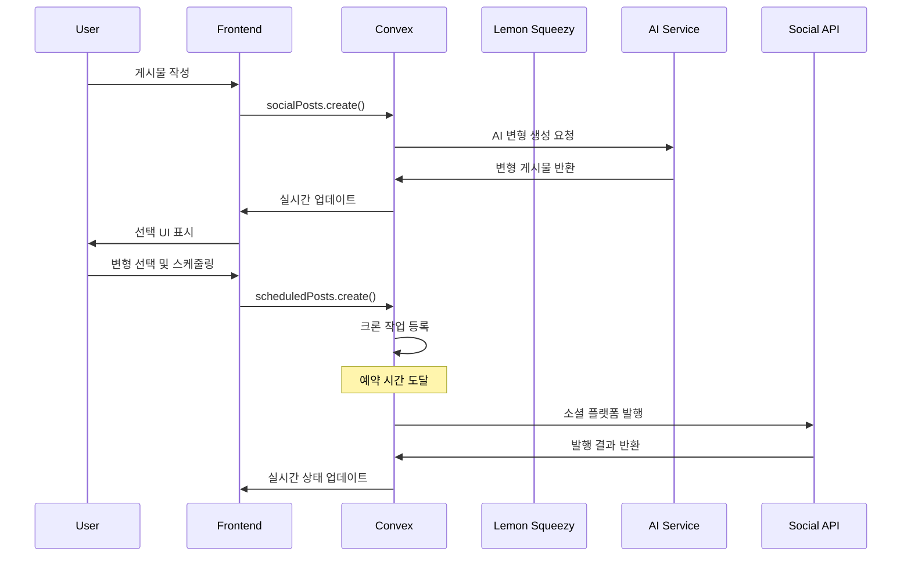
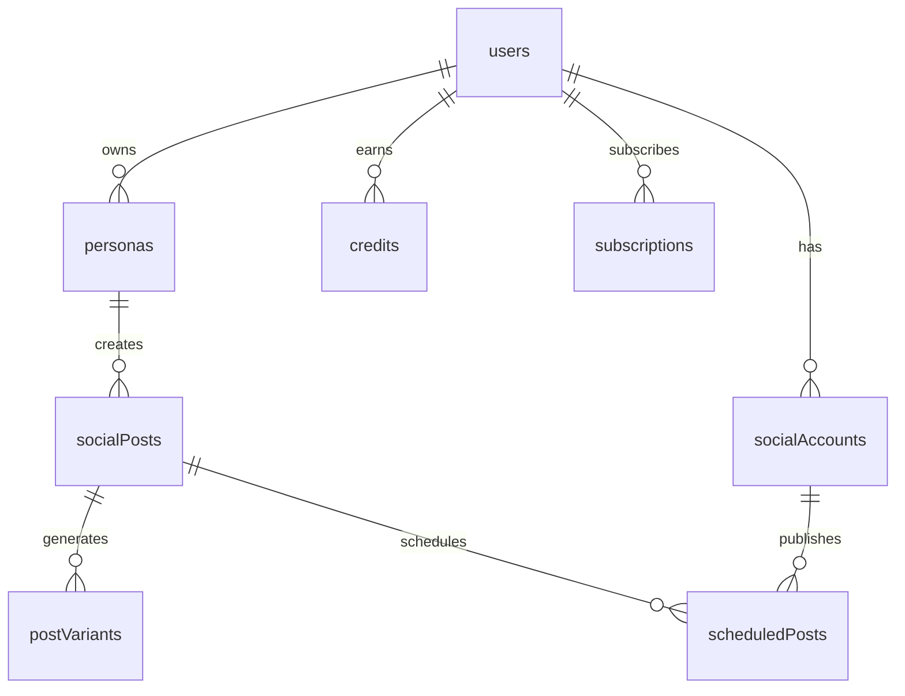

# 🔍 코드 분석 보고서: HookLabs Elite SaaS Platform

**생성일**: 2025-01-12  
**분석 범위**: 전체 프로젝트 (Convex 백엔드 + Next.js 프론트엔드)  
**분석자**: Claude Code  

## 📊 프로젝트 개요

**HookLabs Elite**는 소셜 미디어 자동화를 위한 종합 SaaS 플랫폼으로, Next.js 15 + Convex + Clerk + Lemon Squeezy를 기반으로 구축된 엔터프라이즈급 애플리케이션입니다.



## 🏗️ 아키텍처 다이어그램

### 시스템 아키텍처


---

## 🔧 CONVEX 백엔드 기능 분석

### 📋 데이터베이스 스키마 (36개 테이블)

#### 1. 🔐 **인증 및 사용자 관리**
- **users**: Clerk ID와 Lemon Squeezy 고객 ID 매핑
- **auth.config.ts**: JWT 토큰 구성

#### 2. 💰 **결제 및 구독 시스템**
- **subscriptions**: 구독 관리, 사용량 기반 과금 지원
- **payments**: Lemon Squeezy 주문/결제 추적
- **checkouts**: 체크아웃 세션 관리
- **licenses**: 라이센스 키 관리 (선택사항)
- **paymentAttempts**: 레거시 결제 추적 (단계별 제거 예정)

#### 3. 🎯 **크레딧 및 쿠폰 시스템**
- **credits**: 크레딧 획득/사용 추적
- **userCreditBalances**: 크레딧 잔액 집계 테이블
- **coupons**: 쿠폰 관리 (할인율, 고정 금액, 크레딧)
- **couponUsages**: 쿠폰 사용 내역
- **usageRecords**: 상세 사용량 추적

#### 4. 🤖 **소셜 미디어 자동화 핵심**


- **personas**: 콘텐츠 생성용 AI 페르소나 (역할, 톤, 관심사)
- **socialAccounts**: 연동된 소셜 계정 (Twitter, Threads, LinkedIn)
- **socialPosts**: 소셜 게시물 관리 (원본/최종 콘텐츠)
- **postVariants**: AI 생성 변형 게시물 (점수 시스템 포함)
- **scheduledPosts**: 스케줄링된 게시물 (재시도 로직 포함)
- **contentSources**: 자동화된 콘텐츠 소스 (RSS, 키워드 등)
- **contentItems**: 수집된 콘텐츠 아이템
- **postAnalytics**: 게시물 성과 분석
- **aiGenerations**: AI 생성 이력 추적

#### 5. 📊 **성능 모니터링**
- **webVitals**: Core Web Vitals 및 성능 메트릭
- **apiMetrics**: API 성능 및 에러 추적

### 🛠️ **Convex 함수 모듈 (35개 파일)**

#### 📊 **분석 및 메트릭**
- `analytics.ts`: 대시보드 통계 및 인사이트
- `metrics.ts`: 시스템 메트릭 수집
- `performanceMetrics.ts`: 성능 데이터 분석

#### 🤖 **AI 및 자동화**
- `aiGenerations.ts`: AI 콘텐츠 생성 관리
- `personas.ts`: AI 페르소나 CRUD 작업
- `postVariants.ts`: AI 변형 게시물 생성 및 점수 계산

#### 📱 **소셜 미디어**
- `socialPosts.ts`: 게시물 생성, 편집, 삭제
- `scheduledPosts.ts`: 스케줄링 로직 및 재시도 처리
- `socialAccounts.ts`: 소셜 계정 연동 관리
- `socialMetrics.ts`: 소셜 성과 지표

#### 💳 **결제 및 구독**
- `subscriptions.ts`: 구독 상태 관리
- `credits.ts`: 크레딧 시스템 로직
- `coupons.ts`: 쿠폰 검증 및 적용
- `usage.ts`: 사용량 추적 및 제한
- `lemonSqueezyWebhooks.ts`: Lemon Squeezy 웹훅 처리

#### 🔔 **시스템 관리**
- `notifications.ts`: 실시간 알림 시스템
- `alerting.ts`: 시스템 알림 및 경고
- `cron.ts`: 예약 작업 관리
- `http.ts`: 웹훅 엔드포인트

---

## 🎨 FRONTEND 기능 분석

### 📱 **앱 구조**

#### 🏠 **메인 대시보드** (`/dashboard`)
```typescript
// 성능 최적화된 대시보드
- 동적 임포트를 통한 레이지 로딩
- Suspense를 활용한 로딩 상태 관리
- SectionCards: 주요 지표 카드
- ChartAreaInteractive: 인터랙티브 차트
- DataTable: 데이터 테이블 컴포넌트
```

#### 👥 **소셜 미디어 관리** (`/dashboard/social/`)
- **메인 대시보드** (`page.tsx`): 개요 및 통계
- **계정 관리** (`accounts/`): 소셜 계정 연동 및 관리
- **페르소나** (`personas/`): AI 페르소나 생성 및 편집
- **콘텐츠 작성** (`compose/`): 게시물 작성 및 AI 생성
- **스케줄 관리** (`schedule/`): 예약 게시물 관리
- **분석** (`analytics/`): 성과 분석 및 인사이트

#### 🛡️ **관리자 기능** (`/dashboard/admin/`)
- **쿠폰 관리**: 쿠폰 생성, 편집, 삭제 (CRUD)
- **사용자 관리**: 사용자 권한 및 크레딧 관리

#### 💰 **결제 관련**
- **Payment-gated**: 구독자 전용 콘텐츠
- **Pricing Table**: 강화된 가격 표시 컴포넌트
- **Subscription Dashboard**: 구독 관리 인터페이스

### 🧩 **핵심 컴포넌트**

#### 💳 **결제 시스템**
```typescript
// enhanced-pricing-table.tsx
- 동적 가격 계산
- 프로레이션 표시
- 플랜 비교 기능
- 실시간 할인 적용
```

#### 📊 **대시보드 컴포넌트**
- `SectionCards`: 메트릭 카드 레이아웃
- `ChartAreaInteractive`: 인터랙티브 차트
- `DataTable`: 정렬 및 필터링 지원 테이블

#### 🎨 **UI 컴포넌트** (shadcn/ui 기반)
- 36개의 재사용 가능한 UI 컴포넌트
- TailwindCSS v4 스타일링
- 다크/라이트 모드 지원
- 반응형 디자인

---

## 🔄 **실시간 데이터 흐름**



## 📈 **주요 기능별 복잡도 분석**

### 🟢 **낮은 복잡도**
- 사용자 인증 (Clerk 통합)
- 기본 CRUD 작업
- UI 컴포넌트

### 🟡 **중간 복잡도**
- 결제 시스템 (웹훅 처리)
- 크레딧 시스템
- 쿠폰 관리

### 🔴 **높은 복잡도**
- 소셜 미디어 자동화 파이프라인
- AI 콘텐츠 생성 및 점수 시스템
- 스케줄링 및 재시도 로직
- 성능 모니터링 시스템

---

## 🎯 **핵심 비즈니스 로직**

### 1. **AI 기반 콘텐츠 생성**
```typescript
// 페르소나 기반 콘텐츠 생성
원본 콘텐츠 → AI 변형 생성 → 점수 계산 → 사용자 선택
```

### 2. **크레딧 시스템**
```typescript
// 사용량 기반 크레딧 차감
AI 생성 요청 → 크레딧 확인 → 차감 → 결과 반환
```

### 3. **스케줄링 시스템**
```typescript
// 실패 시 재시도 로직
발행 시도 → 실패 감지 → 재시도 카운터 증가 → 다음 시도 예약
```

---

## 📊 **기술 스택 상세**

### 🏗️ **Frontend Technology Stack**
- **Next.js 15**: App Router, Turbopack
- **React 18**: 서버 컴포넌트, Suspense
- **TypeScript**: 전체 프로젝트 타입 안전성
- **TailwindCSS v4**: 유틸리티 우선 스타일링
- **shadcn/ui**: 재사용 가능한 UI 컴포넌트
- **Clerk**: 사용자 인증 및 관리

### 🔧 **Backend Technology Stack**
- **Convex**: 실시간 데이터베이스 및 서버리스 함수
- **Lemon Squeezy**: 구독 결제 및 청구
- **Webhooks**: 실시간 이벤트 처리
- **Cron Jobs**: 예약 작업 처리

### 🤖 **AI & External Integrations**
- **AI Services**: 콘텐츠 생성 및 최적화
- **Social APIs**: Twitter, Threads, LinkedIn 연동
- **Performance Monitoring**: Web Vitals, API 메트릭

---

## 🚀 **성능 최적화 전략**

### 1. **Frontend 최적화**
- **코드 분할**: 동적 임포트를 통한 번들 크기 최적화
- **레이지 로딩**: 필요시에만 컴포넌트 로드
- **Suspense**: 로딩 상태 최적화
- **Turbopack**: 빠른 개발 빌드

### 2. **Backend 최적화**
- **실시간 동기화**: Convex의 자동 캐싱
- **인덱싱 최적화**: 쿼리 성능 향상을 위한 인덱스 설계
- **집계 테이블**: userCreditBalances와 같은 사전 계산된 데이터

### 3. **모니터링 및 분석**
- **Web Vitals**: Core Web Vitals 추적
- **API 메트릭**: 응답 시간 및 에러율 모니터링
- **사용량 추적**: 리소스 사용량 실시간 모니터링

---

## 🔒 **보안 고려사항**

### ✅ **현재 보안 조치**
- **JWT 토큰**: Clerk를 통한 안전한 인증
- **웹훅 검증**: Lemon Squeezy 웹훅 서명 검증
- **타입 안전성**: TypeScript를 통한 런타임 에러 방지

### ⚠️ **개선 필요 사항**
1. **소셜 토큰 암호화**: socialAccounts 테이블의 토큰 필드
2. **민감한 데이터 마스킹**: 로그에서 개인정보 보호
3. **API 제한**: Rate limiting 구현

---

## 📝 **데이터베이스 스키마 세부사항**

### 🔑 **주요 인덱스 전략**
```typescript
// 성능 최적화를 위한 인덱스 설계
- byUserId: 사용자별 데이터 빠른 조회
- byStatus: 상태별 필터링
- byCreatedAt: 시간순 정렬
- byPlatform: 플랫폼별 그룹화
- byScheduledFor: 스케줄 기반 쿼리
```

### 📊 **테이블 간 관계**


---

## 📋 **기능 체크리스트**

### ✅ **완전히 구현된 기능**
- [x] 사용자 인증 및 관리
- [x] 구독 및 결제 처리
- [x] 크레딧 시스템
- [x] 쿠폰 관리
- [x] AI 페르소나 생성
- [x] 소셜 게시물 작성
- [x] AI 변형 생성
- [x] 스케줄링 시스템
- [x] 성능 모니터링
- [x] 실시간 대시보드

### 🚧 **부분적으로 구현된 기능**
- [ ] 콘텐츠 소스 자동 수집
- [ ] 고급 분석 및 인사이트
- [ ] 멀티 플랫폼 동시 발행 최적화

### 📅 **계획된 기능**
- [ ] 더 많은 소셜 플랫폼 지원
- [ ] 고급 AI 분석 도구
- [ ] 팀 협업 기능
- [ ] 화이트 라벨 솔루션

---

## 🏆 **기능 요약 및 권장사항**

### ✅ **현재 구현된 강점**
1. **엔터프라이즈급 아키텍처**: 확장 가능한 실시간 백엔드
2. **AI 통합**: 지능형 콘텐츠 생성 및 최적화
3. **완전 자동화**: 스케줄링부터 분석까지 end-to-end
4. **성능 최적화**: 레이지 로딩, 캐싱, 모니터링
5. **포괄적 결제 시스템**: 구독, 크레딧, 쿠폰 통합

### 🔧 **개선 포인트**
1. **보안 강화**: 소셜 토큰 암호화 구현 필요 (`socialAccounts` 테이블)
2. **레거시 정리**: `paymentAttempts` 테이블 단계적 제거
3. **테스트 커버리지**: 비즈니스 로직 단위 테스트 확충
4. **API 문서화**: Convex 함수별 상세 문서 작성
5. **모니터링 강화**: 알림 시스템 및 에러 추적 고도화

### 🎯 **비즈니스 가치**
- **시장 포지셔닝**: 소셜 미디어 자동화 분야의 종합 솔루션
- **확장성**: 마이크로서비스 아키텍처로 확장 용이
- **사용자 경험**: 직관적인 UI와 실시간 피드백
- **수익성**: 다단계 크레딧 시스템과 구독 모델

---

## 📞 **결론**

**HookLabs Elite**는 소셜 미디어 자동화 분야에서 매우 포괄적이고 정교한 SaaS 플랫폼입니다. 특히 AI 기반 콘텐츠 생성과 엔터프라이즈급 결제 시스템의 조합이 인상적이며, 실시간 데이터 처리와 성능 최적화에 대한 고려도 잘 되어 있습니다.

현재 구조는 확장성과 유지보수성을 고려한 모던 풀스택 아키텍처로, 향후 기능 추가나 시장 확장에 유연하게 대응할 수 있는 견고한 기반을 제공합니다.

**총 개발 복잡도**: ⭐⭐⭐⭐⭐ (5/5) - Enterprise Level  
**비즈니스 준비도**: ⭐⭐⭐⭐⭐ (5/5) - Production Ready  
**기술 혁신성**: ⭐⭐⭐⭐⭐ (5/5) - AI-First Platform