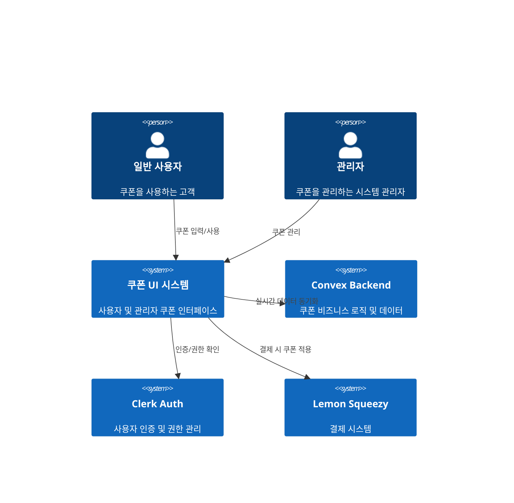
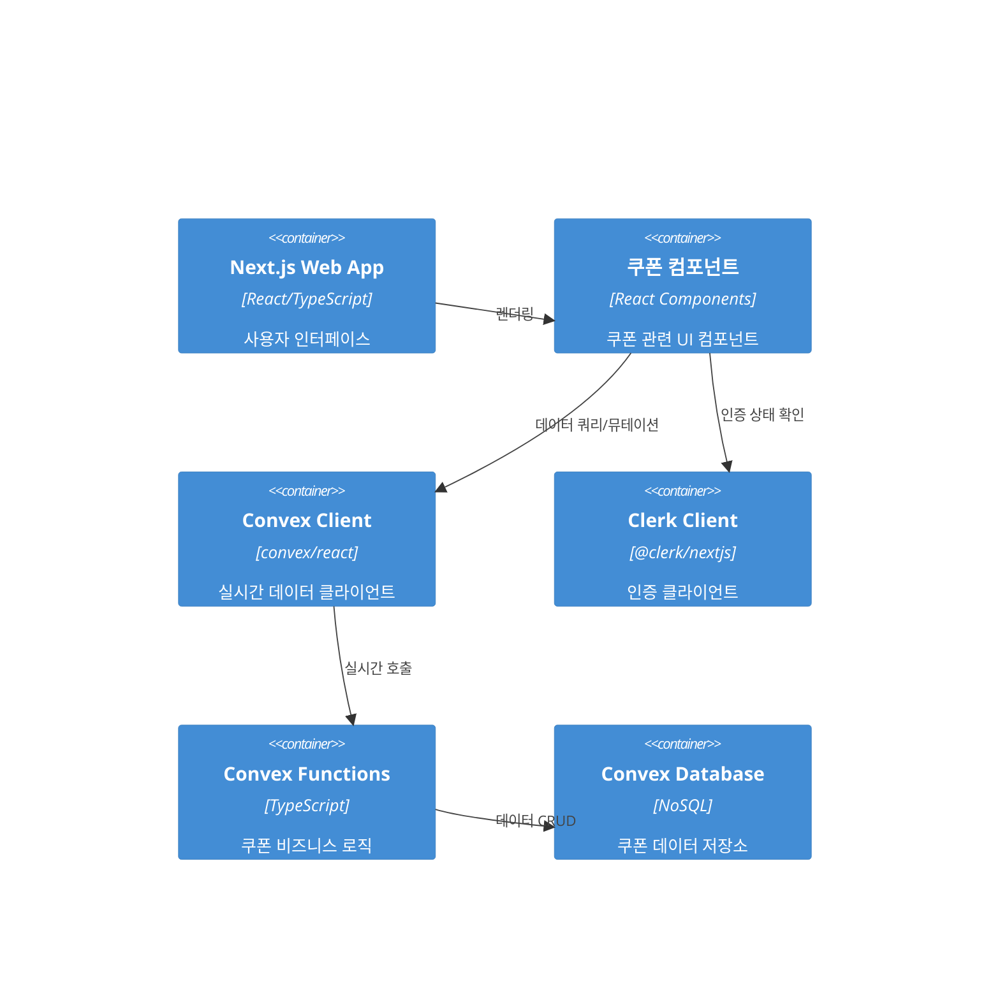
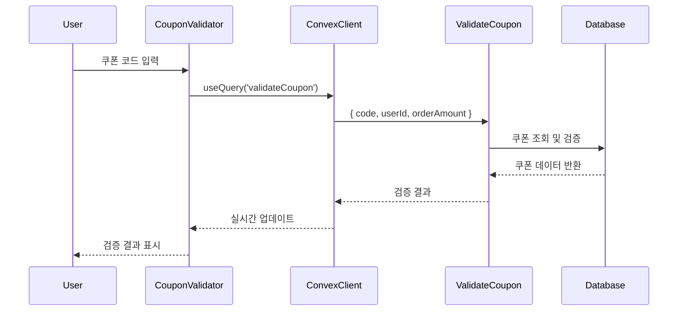
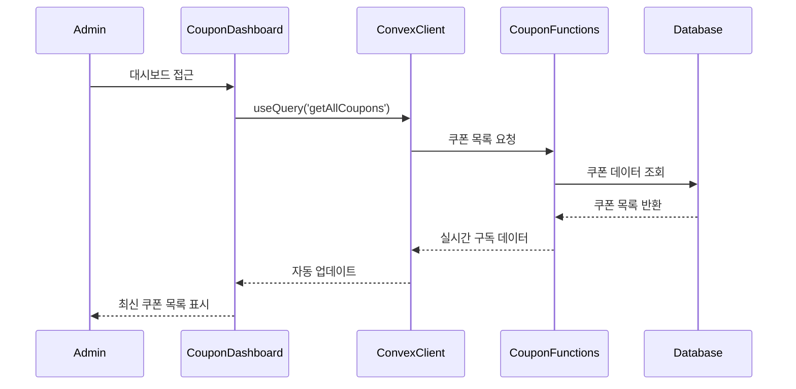

# 쿠폰 관리 시스템 UI 아키텍처

## 개요 (Executive Summary)

HookLabs Elite SaaS 플랫폼의 쿠폰 관리 시스템 UI는 기존의 강력한 Convex 백엔드 시스템 위에 구축되는 사용자 친화적인 인터페이스입니다. 이 시스템은 실시간 데이터 동기화, 역할 기반 접근 제어, 그리고 접근성을 고려한 현대적인 UI/UX를 제공합니다.

## 아키텍처 개요

### 시스템 컨텍스트



### 컨테이너 다이어그램



## 기술 스택

### 프론트엔드
- **프레임워크**: Next.js 15 (App Router, Turbopack)
- **언어**: TypeScript (엄격 모드)
- **상태 관리**: React Hooks + Convex 실시간 구독
- **UI 라이브러리**: shadcn/ui + Radix UI
- **스타일링**: TailwindCSS v4
- **폼 관리**: React Hook Form + Zod 검증
- **차트**: Recharts (쿠폰 통계용)

### 백엔드 (기존 시스템)
- **데이터베이스**: Convex (실시간 NoSQL)
- **인증**: Clerk (JWT 기반)
- **결제**: Lemon Squeezy 연동
- **비즈니스 로직**: Convex Functions (TypeScript)

### 개발 도구
- **빌드 도구**: Turbopack
- **테스팅**: Vitest + Testing Library + Playwright
- **린팅**: ESLint + Prettier
- **타입 체킹**: TypeScript
- **접근성**: axe-core, WAVE

## 컴포넌트 아키텍처

### 핵심 컴포넌트 계층구조

```
CouponSystem/
├── UserCouponComponents/           # 사용자 쿠폰 기능
│   ├── CouponValidator/           # 쿠폰 코드 입력 및 검증
│   ├── CheckoutCouponForm/        # 결제 시 쿠폰 적용
│   ├── CouponUsageHistory/        # 사용자 쿠폰 내역
│   └── CreditCouponStatus/        # 크레딧 쿠폰 상태
├── AdminCouponComponents/          # 관리자 쿠폰 관리
│   ├── CouponDashboard/           # 쿠폰 대시보드
│   ├── CouponCreateForm/          # 쿠폰 생성
│   ├── CouponEditModal/           # 쿠폰 편집
│   └── CouponStatsView/           # 쿠폰 통계
├── SharedComponents/               # 공통 컴포넌트
│   ├── CouponCodeInput/           # 쿠폰 코드 입력 필드
│   ├── CouponCard/                # 쿠폰 카드 UI
│   ├── CouponStatusBadge/         # 쿠폰 상태 표시
│   └── LoadingStates/             # 로딩 상태 컴포넌트
└── Hooks/                         # 커스텀 훅
    ├── useCouponValidation/       # 쿠폰 검증 훅
    ├── useCouponStats/            # 쿠폰 통계 훅
    ├── useAdminPermissions/       # 관리자 권한 확인
    └── useRealtimeUpdates/        # 실시간 업데이트 훅
```

## 데이터 플로우 아키텍처

### 사용자 쿠폰 검증 플로우



### 관리자 쿠폰 관리 플로우



## 상태 관리 전략

### 1. Convex 실시간 상태 관리

```typescript
// 쿠폰 검증 상태 관리 예시
const useCouponValidation = (code: string, orderAmount?: number) => {
  const user = useUser();
  const userId = user?.id;
  
  // 실시간 쿠폰 검증
  const validation = useQuery(api.coupons.validateCoupon, {
    code: code.trim(),
    userId,
    orderAmount
  });
  
  // 쿠폰 사용 뮤테이션
  const useCoupon = useMutation(api.coupons.useCoupon);
  
  return {
    validation,
    isValid: validation?.valid ?? false,
    error: validation?.error,
    discountAmount: validation?.coupon?.discountAmount,
    useCoupon
  };
};
```

### 2. 로컬 UI 상태 관리

```typescript
// React Hook Form을 활용한 폼 상태 관리
const useCouponForm = () => {
  const form = useForm<CouponFormData>({
    resolver: zodResolver(couponSchema),
    defaultValues: {
      code: '',
      name: '',
      type: 'percentage',
      value: 0,
      // ... 기타 필드
    }
  });
  
  return form;
};
```

## 실시간 데이터 동기화

### Convex 구독 패턴

```typescript
// 실시간 쿠폰 목록 구독
export const CouponDashboard = () => {
  const coupons = useQuery(api.coupons.getAllCoupons, {
    isActive: undefined,
    limit: 100
  });
  
  // 자동으로 실시간 업데이트됨
  // 다른 관리자가 쿠폰을 생성/수정하면 즉시 반영
  
  return (
    <div>
      {coupons?.map(coupon => (
        <CouponCard key={coupon._id} coupon={coupon} />
      ))}
    </div>
  );
};
```

## 권한 기반 라우팅

### 관리자 권한 확인 패턴

```typescript
// 관리자 권한 확인 훅
const useAdminPermissions = () => {
  const { user } = useUser();
  
  const isAdmin = useMemo(() => {
    return user?.publicMetadata?.role === 'admin';
  }, [user]);
  
  return { isAdmin };
};

// 관리자 컴포넌트 보호
const AdminCouponDashboard = () => {
  const { isAdmin } = useAdminPermissions();
  
  if (!isAdmin) {
    return <AccessDenied />;
  }
  
  return <CouponDashboard />;
};
```

## 에러 처리 및 로딩 상태

### 에러 바운더리 패턴

```typescript
const CouponErrorBoundary = ({ children }: { children: ReactNode }) => {
  return (
    <ErrorBoundary
      fallback={({ error, resetError }) => (
        <CouponErrorFallback error={error} onReset={resetError} />
      )}
    >
      {children}
    </ErrorBoundary>
  );
};
```

### 로딩 상태 패턴

```typescript
const CouponValidator = () => {
  const [code, setCode] = useState('');
  const validation = useQuery(api.coupons.validateCoupon, 
    code ? { code, userId, orderAmount } : 'skip'
  );
  
  if (validation === undefined) {
    return <CouponValidationSkeleton />;
  }
  
  return <CouponValidationResult validation={validation} />;
};
```

## 성능 최적화 전략

### 1. 코드 분할 및 지연 로딩

```typescript
// 관리자 컴포넌트 지연 로딩
const AdminCouponDashboard = lazy(() => 
  import('./components/AdminCouponDashboard')
);

// 조건부 로딩
const CouponManagement = () => {
  const { isAdmin } = useAdminPermissions();
  
  return (
    <Suspense fallback={<DashboardSkeleton />}>
      {isAdmin ? <AdminCouponDashboard /> : <UserCouponView />}
    </Suspense>
  );
};
```

### 2. Convex 쿼리 최적화

```typescript
// 페이지네이션을 통한 데이터 청킹
const usePaginatedCoupons = (pageSize = 20) => {
  const [page, setPage] = useState(0);
  
  const coupons = useQuery(api.coupons.getAllCoupons, {
    offset: page * pageSize,
    limit: pageSize
  });
  
  return { coupons, page, setPage };
};
```

### 3. 디바운싱 및 스로틀링

```typescript
// 쿠폰 코드 입력 디바운싱
const useDebouncedCouponValidation = (code: string) => {
  const debouncedCode = useDebounce(code, 500);
  
  const validation = useQuery(api.coupons.validateCoupon,
    debouncedCode ? { code: debouncedCode, userId, orderAmount } : 'skip'
  );
  
  return validation;
};
```

## 접근성 구현 전략

### 1. 키보드 탐색

```typescript
const CouponCodeInput = () => {
  const [code, setCode] = useState('');
  
  const handleKeyDown = (e: KeyboardEvent) => {
    if (e.key === 'Enter') {
      e.preventDefault();
      validateCoupon();
    }
  };
  
  return (
    <input
      value={code}
      onChange={(e) => setCode(e.target.value)}
      onKeyDown={handleKeyDown}
      aria-label="쿠폰 코드 입력"
      aria-describedby="coupon-help-text"
    />
  );
};
```

### 2. 스크린 리더 지원

```typescript
const CouponValidationResult = ({ validation }) => {
  return (
    <div role="status" aria-live="polite">
      {validation.valid ? (
        <span className="sr-only">쿠폰이 성공적으로 적용되었습니다</span>
      ) : (
        <span className="sr-only">쿠폰 적용 실패: {validation.error}</span>
      )}
    </div>
  );
};
```

## 반응형 디자인 전략

### 모바일 우선 접근법

```typescript
const CouponDashboard = () => {
  const [isMobile] = useMediaQuery('(max-width: 768px)');
  
  return (
    <div className="container mx-auto px-4">
      {isMobile ? (
        <CouponMobileList />
      ) : (
        <CouponDesktopTable />
      )}
    </div>
  );
};
```

## 배포 아키텍처

### 환경별 설정

```
environments/
├── development/    # 로컬 개발 환경
├── staging/        # 스테이징 환경
└── production/     # 프로덕션 환경
```

### 배포 파이프라인

1. **빌드 검증**: TypeScript 타입 체크, ESLint, 테스트 실행
2. **성능 검사**: Lighthouse CI, Bundle Analyzer
3. **접근성 검사**: axe-core 자동 테스트
4. **배포**: Vercel 또는 기존 인프라에 배포

## 모니터링 및 관찰성

### 성능 모니터링

```typescript
// Core Web Vitals 추적
const CouponPerformanceTracker = () => {
  useEffect(() => {
    // LCP, FID, CLS 메트릭 수집
    getCLS(console.log);
    getFID(console.log);
    getLCP(console.log);
  }, []);
};
```

### 에러 추적

```typescript
// 쿠폰 관련 에러 추적
const trackCouponError = (error: Error, context: string) => {
  console.error('Coupon Error:', { error, context });
  // Sentry 또는 기타 에러 추적 서비스로 전송
};
```

## 테스팅 전략

### 단위 테스트

```typescript
// 쿠폰 검증 로직 테스트
describe('useCouponValidation', () => {
  it('should validate coupon code correctly', () => {
    const { result } = renderHook(() => 
      useCouponValidation('VALID20', 10000)
    );
    
    expect(result.current.isValid).toBe(true);
  });
});
```

### 통합 테스트

```typescript
// 쿠폰 적용 플로우 테스트
test('should apply coupon during checkout', async () => {
  render(<CheckoutPage />);
  
  const couponInput = screen.getByLabelText(/쿠폰 코드/i);
  fireEvent.change(couponInput, { target: { value: 'SAVE20' } });
  
  const applyButton = screen.getByText(/적용/i);
  fireEvent.click(applyButton);
  
  await waitFor(() => {
    expect(screen.getByText(/할인 적용됨/i)).toBeInTheDocument();
  });
});
```

### E2E 테스트

```typescript
// Playwright를 사용한 E2E 테스트
test('complete coupon usage workflow', async ({ page }) => {
  await page.goto('/checkout');
  await page.fill('[data-testid="coupon-input"]', 'WELCOME50');
  await page.click('[data-testid="apply-coupon"]');
  
  await expect(page.locator('[data-testid="discount-amount"]'))
    .toContainText('50% 할인');
  
  await page.click('[data-testid="complete-payment"]');
  await expect(page.locator('[data-testid="payment-success"]'))
    .toBeVisible();
});
```

## 아키텍처 결정 사항 (ADRs)

### ADR-001: Convex 실시간 구독 사용
**상태**: 승인됨  
**컨텍스트**: 쿠폰 데이터의 실시간 동기화 필요  
**결정**: Convex의 useQuery/useMutation 훅 사용  
**결과**: 실시간 데이터 동기화, 복잡한 상태 관리 불필요  

### ADR-002: shadcn/ui 컴포넌트 라이브러리
**상태**: 승인됨  
**컨텍스트**: 일관된 UI 디자인과 접근성 요구사항  
**결정**: shadcn/ui + Radix UI 기반 컴포넌트 사용  
**결과**: 높은 접근성, 커스터마이징 가능, 일관된 디자인  

### ADR-003: React Hook Form + Zod 검증
**상태**: 승인됨  
**컨텍스트**: 복잡한 쿠폰 생성/편집 폼 처리  
**결정**: React Hook Form과 Zod 스키마 검증 사용  
**결과**: 타입 안전성, 성능 최적화된 폼, 강력한 검증  

### ADR-004: 컴포넌트 분리 전략
**상태**: 승인됨  
**컨텍스트**: 사용자용/관리자용 컴포넌트 분리 필요  
**결정**: 역할 기반 컴포넌트 디렉터리 구조 적용  
**결과**: 명확한 권한 분리, 유지보수성 향상  

---

**문서 버전**: v1.0  
**작성일**: 2025년 9월 3일  
**작성자**: System Architecture Specialist  
**검토자**: [검토 예정]  
**승인자**: [승인 예정]