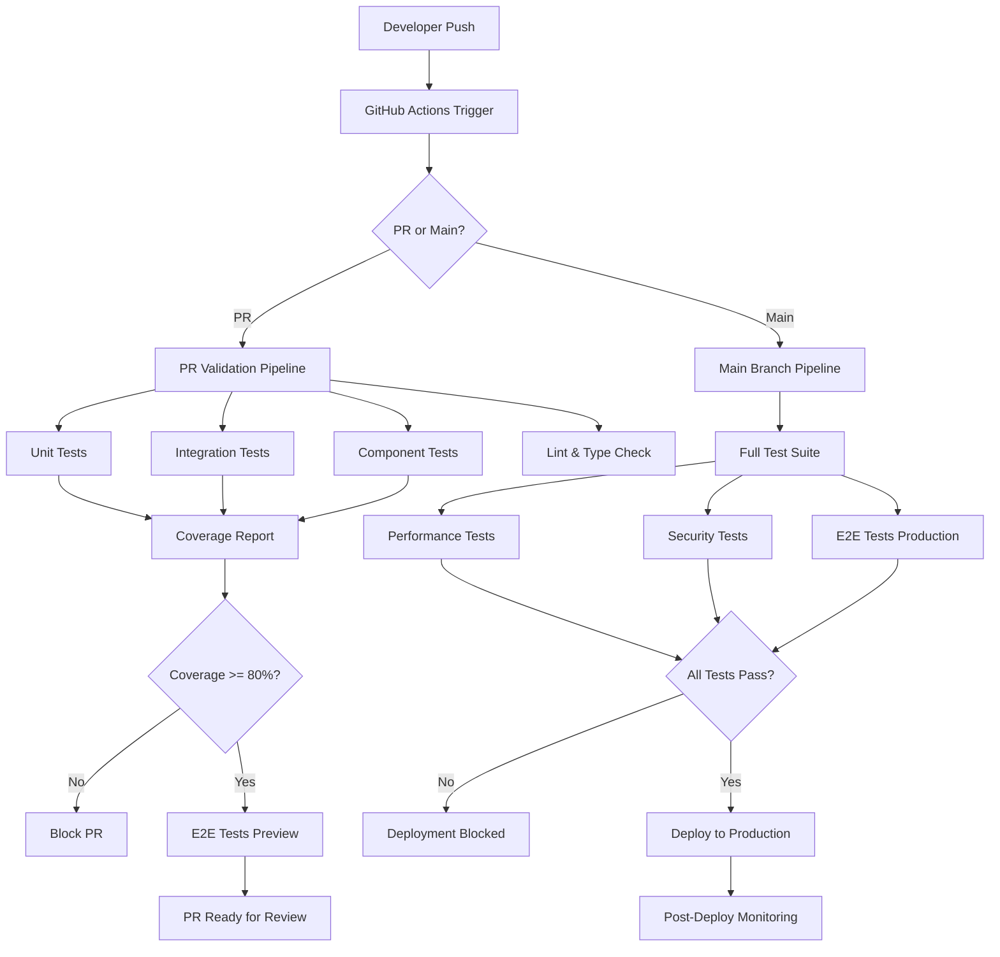

# 쿠폰 관리 시스템 테스트 자동화 가이드

## 개요

이 문서는 쿠폰 관리 시스템의 테스트 자동화 구현 및 CI/CD 파이프라인 통합에 대한 종합적인 가이드입니다. 자동화된 테스트를 통해 코드 품질을 보장하고, 빠른 피드백 루프를 구축하며, 안전한 배포를 실현하는 것이 목표입니다.

## 테스트 자동화 아키텍처

### 전체 아키텍처 다이어그램



## CI/CD 파이프라인 구성

### GitHub Actions 워크플로우

#### 1. PR 검증 파이프라인
```yaml
# .github/workflows/pr-validation.yml
name: PR Validation Pipeline

on:
  pull_request:
    branches: [ main ]
    paths:
      - 'components/coupons/**'
      - 'hooks/use-coupon*'
      - 'convex/coupons.ts'
      - '__tests__/**'

env:
  NODE_VERSION: '20'
  CONVEX_DEPLOYMENT: ${{ secrets.CONVEX_TEST_DEPLOYMENT }}

jobs:
  setup:
    runs-on: ubuntu-latest
    outputs:
      cache-key: ${{ steps.cache-key.outputs.key }}
    steps:
      - uses: actions/checkout@v4
      
      - name: Generate cache key
        id: cache-key
        run: echo "key=${{ runner.os }}-node-${{ hashFiles('**/package-lock.json') }}" >> $GITHUB_OUTPUT
      
      - uses: actions/setup-node@v4
        with:
          node-version: ${{ env.NODE_VERSION }}
          cache: 'npm'
          cache-dependency-path: package-lock.json
      
      - name: Install dependencies
        run: npm ci --frozen-lockfile

  lint-and-types:
    needs: setup
    runs-on: ubuntu-latest
    steps:
      - uses: actions/checkout@v4
      - uses: actions/setup-node@v4
        with:
          node-version: ${{ env.NODE_VERSION }}
          cache: 'npm'
      
      - run: npm ci --frozen-lockfile
      - run: npm run lint
      - run: npm run type-check

  unit-tests:
    needs: setup
    runs-on: ubuntu-latest
    strategy:
      matrix:
        shard: [1, 2, 3] # 테스트 분산 실행
    steps:
      - uses: actions/checkout@v4
      - uses: actions/setup-node@v4
        with:
          node-version: ${{ env.NODE_VERSION }}
          cache: 'npm'
      
      - run: npm ci --frozen-lockfile
      - run: npm run test:unit -- --shard=${{ matrix.shard }}/3 --reporter=json --outputFile=unit-test-results-${{ matrix.shard }}.json
      
      - name: Upload test results
        uses: actions/upload-artifact@v4
        if: always()
        with:
          name: unit-test-results-${{ matrix.shard }}
          path: unit-test-results-${{ matrix.shard }}.json

  integration-tests:
    needs: setup
    runs-on: ubuntu-latest
    services:
      # Mock Convex backend for integration tests
      convex-mock:
        image: convex/mock-backend:latest
        ports:
          - 3001:3001
    steps:
      - uses: actions/checkout@v4
      - uses: actions/setup-node@v4
        with:
          node-version: ${{ env.NODE_VERSION }}
          cache: 'npm'
      
      - run: npm ci --frozen-lockfile
      - run: npm run test:integration
        env:
          CONVEX_URL: http://localhost:3001

  component-tests:
    needs: setup
    runs-on: ubuntu-latest
    steps:
      - uses: actions/checkout@v4
      - uses: actions/setup-node@v4
        with:
          node-version: ${{ env.NODE_VERSION }}
          cache: 'npm'
      
      - run: npm ci --frozen-lockfile
      - run: npm run test:components
      
      - name: Generate component test report
        run: npm run test:components -- --reporter=html --outputFile=component-test-report.html
      
      - name: Upload component test report
        uses: actions/upload-artifact@v4
        with:
          name: component-test-report
          path: component-test-report.html

  coverage-report:
    needs: [unit-tests, integration-tests, component-tests]
    runs-on: ubuntu-latest
    steps:
      - uses: actions/checkout@v4
      - uses: actions/setup-node@v4
        with:
          node-version: ${{ env.NODE_VERSION }}
          cache: 'npm'
      
      - run: npm ci --frozen-lockfile
      
      - name: Download unit test results
        uses: actions/download-artifact@v4
        with:
          pattern: unit-test-results-*
          merge-multiple: true
      
      - name: Generate coverage report
        run: |
          npm run test:coverage -- --reporter=json --outputFile=coverage.json
          npm run test:coverage -- --reporter=html --outputDir=coverage-html
      
      - name: Check coverage threshold
        run: |
          COVERAGE=$(node -p "JSON.parse(require('fs').readFileSync('coverage.json', 'utf8')).total.lines.pct")
          if (( $(echo "$COVERAGE < 80" | bc -l) )); then
            echo "Coverage $COVERAGE% is below 80% threshold"
            exit 1
          fi
          echo "Coverage: $COVERAGE%"
      
      - name: Upload coverage to Codecov
        uses: codecov/codecov-action@v4
        with:
          file: ./coverage.json
          flags: coupon-system
          name: coupon-coverage
          fail_ci_if_error: true
      
      - name: Comment PR with coverage
        uses: marocchino/sticky-pull-request-comment@v2
        with:
          header: coverage
          message: |
            ## 📊 Coverage Report
            
            | Metric | Coverage | Status |
            |--------|----------|---------|
            | Lines | ${{ env.COVERAGE_LINES }}% | ${{ env.COVERAGE_LINES >= 80 && '✅' || '❌' }} |
            | Branches | ${{ env.COVERAGE_BRANCHES }}% | ${{ env.COVERAGE_BRANCHES >= 80 && '✅' || '❌' }} |
            | Functions | ${{ env.COVERAGE_FUNCTIONS }}% | ${{ env.COVERAGE_FUNCTIONS >= 80 && '✅' || '❌' }} |
            | Statements | ${{ env.COVERAGE_STATEMENTS }}% | ${{ env.COVERAGE_STATEMENTS >= 80 && '✅' || '❌' }} |

  e2e-preview:
    needs: [lint-and-types, coverage-report]
    runs-on: ubuntu-latest
    if: success()
    steps:
      - uses: actions/checkout@v4
      - uses: actions/setup-node@v4
        with:
          node-version: ${{ env.NODE_VERSION }}
          cache: 'npm'
      
      - run: npm ci --frozen-lockfile
      - run: npm run build
      
      # Deploy to preview environment
      - name: Deploy to preview
        id: deploy-preview
        run: |
          # Deploy to Vercel preview or similar
          echo "preview-url=https://pr-${{ github.event.number }}.preview.hooklabs.com" >> $GITHUB_OUTPUT
      
      # Run E2E tests against preview
      - name: Run E2E tests
        run: npm run test:e2e
        env:
          E2E_BASE_URL: ${{ steps.deploy-preview.outputs.preview-url }}
          CI: true
      
      - name: Upload E2E artifacts
        uses: actions/upload-artifact@v4
        if: failure()
        with:
          name: e2e-screenshots
          path: test-results/

  security-scan:
    needs: setup
    runs-on: ubuntu-latest
    steps:
      - uses: actions/checkout@v4
      
      - name: Run npm audit
        run: npm audit --audit-level high --production
      
      - name: Run Snyk security scan
        uses: snyk/actions/node@master
        env:
          SNYK_TOKEN: ${{ secrets.SNYK_TOKEN }}
        with:
          args: --severity-threshold=medium
      
      - name: CodeQL Analysis
        uses: github/codeql-action/analyze@v3
        with:
          languages: typescript, javascript
          queries: security-and-quality

  pr-status:
    needs: [lint-and-types, coverage-report, e2e-preview, security-scan]
    runs-on: ubuntu-latest
    if: always()
    steps:
      - name: PR Status Check
        run: |
          if [[ "${{ needs.lint-and-types.result }}" == "success" && \
                "${{ needs.coverage-report.result }}" == "success" && \
                "${{ needs.e2e-preview.result }}" == "success" && \
                "${{ needs.security-scan.result }}" == "success" ]]; then
            echo "✅ All checks passed - PR ready for review"
            exit 0
          else
            echo "❌ Some checks failed"
            exit 1
          fi
```

#### 2. 메인 브랜치 파이프라인
```yaml
# .github/workflows/main-pipeline.yml
name: Main Branch Pipeline

on:
  push:
    branches: [ main ]
  schedule:
    # 매일 밤 2시에 전체 테스트 실행
    - cron: '0 2 * * *'

jobs:
  full-test-suite:
    runs-on: ubuntu-latest
    strategy:
      matrix:
        os: [ubuntu-latest, windows-latest, macos-latest]
        node: [18, 20]
        exclude:
          - os: windows-latest
            node: 18
          - os: macos-latest
            node: 18
    
    steps:
      - uses: actions/checkout@v4
      - uses: actions/setup-node@v4
        with:
          node-version: ${{ matrix.node }}
          cache: 'npm'
      
      - run: npm ci --frozen-lockfile
      - run: npm run test:unit
      - run: npm run test:integration
      - run: npm run test:components

  performance-tests:
    runs-on: ubuntu-latest
    steps:
      - uses: actions/checkout@v4
      - uses: actions/setup-node@v4
        with:
          node-version: '20'
          cache: 'npm'
      
      - run: npm ci --frozen-lockfile
      - run: npm run build
      
      # Start application for performance testing
      - name: Start application
        run: |
          npm start &
          sleep 30 # Wait for app to start
      
      # Run K6 load tests
      - name: Run performance tests
        run: |
          # Install K6
          curl https://github.com/grafana/k6/releases/download/v0.47.0/k6-v0.47.0-linux-amd64.tar.gz -L | tar xvz
          sudo cp k6-v0.47.0-linux-amd64/k6 /usr/bin
          
          # Run load tests
          k6 run __tests__/performance/coupon-load-testing.js
          
      - name: Upload performance results
        uses: actions/upload-artifact@v4
        with:
          name: performance-results
          path: reports/

  e2e-production:
    runs-on: ubuntu-latest
    strategy:
      matrix:
        browser: [chromium, firefox, webkit]
    
    steps:
      - uses: actions/checkout@v4
      - uses: actions/setup-node@v4
        with:
          node-version: '20'
          cache: 'npm'
      
      - run: npm ci --frozen-lockfile
      
      - name: Install Playwright
        run: npx playwright install ${{ matrix.browser }}
      
      - run: npm run build
      - run: npm start &
      
      - name: Run E2E tests
        run: npm run test:e2e -- --project=${{ matrix.browser }}
      
      - name: Upload test results
        uses: actions/upload-artifact@v4
        if: always()
        with:
          name: e2e-results-${{ matrix.browser }}
          path: test-results/

  deploy:
    needs: [full-test-suite, performance-tests, e2e-production]
    runs-on: ubuntu-latest
    if: success() && github.ref == 'refs/heads/main'
    
    steps:
      - uses: actions/checkout@v4
      
      - name: Deploy to production
        run: |
          echo "🚀 Deploying to production..."
          # Production deployment logic here
      
      - name: Post-deployment health check
        run: |
          sleep 60 # Wait for deployment
          curl -f https://hooklabs.com/api/health || exit 1
      
      - name: Run smoke tests
        run: |
          npm run test:e2e -- --grep="@smoke"
```

### 로컬 개발 자동화

#### Pre-commit Hooks
```bash
# .husky/pre-commit
#!/usr/bin/env sh
. "$(dirname -- "$0")/_/husky.sh"

echo "🔍 Running pre-commit checks..."

# Run linting
npm run lint || {
  echo "❌ Linting failed. Please fix the issues before committing."
  exit 1
}

# Run type checking
npm run type-check || {
  echo "❌ Type checking failed. Please fix the issues before committing."
  exit 1
}

# Run unit tests for changed files
CHANGED_FILES=$(git diff --cached --name-only --diff-filter=ACM | grep -E '\.(ts|tsx)$' | head -10)

if [ ! -z "$CHANGED_FILES" ]; then
  echo "🧪 Running tests for changed files..."
  npm run test:unit -- --changed || {
    echo "❌ Tests failed. Please fix the failing tests before committing."
    exit 1
  }
fi

echo "✅ Pre-commit checks passed!"
```

#### Pre-push Hooks
```bash
# .husky/pre-push
#!/usr/bin/env sh
. "$(dirname -- "$0")/_/husky.sh"

echo "🚀 Running pre-push checks..."

# Run full test suite for coupon-related changes
if git diff @{upstream} --name-only | grep -q "coupon"; then
  echo "🎫 Coupon-related changes detected. Running coupon test suite..."
  
  npm run test:unit -- --testPathPattern="coupon" || {
    echo "❌ Coupon unit tests failed."
    exit 1
  }
  
  npm run test:integration -- --testPathPattern="coupon" || {
    echo "❌ Coupon integration tests failed."
    exit 1
  }
  
  npm run test:components -- --testPathPattern="coupon" || {
    echo "❌ Coupon component tests failed."
    exit 1
  }
fi

echo "✅ Pre-push checks passed!"
```

## 테스트 실행 최적화

### 병렬 실행 설정

#### Vitest 설정
```typescript
// vitest.config.ts
import { defineConfig } from 'vitest/config'
import { resolve } from 'path'

export default defineConfig({
  test: {
    // 병렬 실행 설정
    threads: true,
    minThreads: 2,
    maxThreads: 4,
    
    // 테스트 샤딩
    shard: process.env.CI ? {
      index: parseInt(process.env.VITEST_SHARD_INDEX || '1'),
      count: parseInt(process.env.VITEST_SHARD_COUNT || '3')
    } : undefined,
    
    // 캐시 최적화
    cache: {
      dir: '.vitest/cache'
    },
    
    // 메모리 최적화
    pool: 'threads',
    poolOptions: {
      threads: {
        minThreads: 2,
        maxThreads: 4
      }
    },
    
    // 테스트 파일 패턴 최적화
    include: [
      '__tests__/**/*.{test,spec}.{ts,tsx}',
      '**/*.{test,spec}.{ts,tsx}'
    ],
    
    // 빠른 실패 설정
    bail: process.env.CI ? 5 : 0,
    
    // 타임아웃 설정
    testTimeout: 30000,
    hookTimeout: 30000,
    
    // 리포팅 최적화
    reporter: process.env.CI ? ['json', 'github-actions'] : ['verbose'],
    
    // 커버리지 최적화
    coverage: {
      provider: 'v8',
      reporter: process.env.CI 
        ? ['json-summary', 'json'] 
        : ['text', 'html', 'json-summary'],
      
      // 병렬 커버리지 수집
      all: true,
      
      // 제외 패턴 최적화
      exclude: [
        'node_modules/**',
        '.next/**',
        'convex/_generated/**',
        '**/*.d.ts',
        '**/__mocks__/**',
        '**/__tests__/**',
        '**/test-utils/**'
      ],
      
      // 임계값 설정
      thresholds: {
        global: {
          branches: 80,
          functions: 80,
          lines: 80,
          statements: 80
        },
        
        // 파일별 임계값
        perFile: true,
        
        // 쿠폰 관련 파일 더 높은 임계값
        'components/coupons/**/*.{ts,tsx}': {
          branches: 85,
          functions: 90,
          lines: 85,
          statements: 85
        }
      }
    }
  }
})
```

#### Playwright 설정
```typescript
// playwright.config.ts
import { defineConfig, devices } from '@playwright/test'

export default defineConfig({
  testDir: '__tests__/e2e',
  
  // 병렬 실행
  workers: process.env.CI ? 2 : undefined,
  
  // 재시도 설정
  retries: process.env.CI ? 2 : 0,
  
  // 타임아웃
  timeout: 30 * 1000,
  expect: { timeout: 5 * 1000 },
  
  // 전역 설정
  use: {
    baseURL: process.env.E2E_BASE_URL || 'http://localhost:3000',
    trace: 'on-first-retry',
    screenshot: 'only-on-failure',
    video: 'retain-on-failure'
  },
  
  // 브라우저 설정
  projects: [
    {
      name: 'chromium',
      use: { ...devices['Desktop Chrome'] }
    },
    
    {
      name: 'firefox',
      use: { ...devices['Desktop Firefox'] }
    },
    
    {
      name: 'webkit',
      use: { ...devices['Desktop Safari'] }
    },
    
    // 모바일 테스트
    {
      name: 'Mobile Chrome',
      use: { ...devices['Pixel 5'] }
    },
    
    {
      name: 'Mobile Safari',
      use: { ...devices['iPhone 12'] }
    }
  ],
  
  // 리포팅
  reporter: process.env.CI 
    ? [['github'], ['json', { outputFile: 'test-results/e2e-results.json' }]]
    : [['html'], ['list']]
})
```

## 테스트 데이터 관리 자동화

### 테스트 데이터 팩토리
```typescript
// __tests__/factories/coupon-factory.ts
import { faker } from '@faker-js/faker'
import type { Coupon, CouponType } from '@/types/coupon'

export class CouponFactory {
  static create(overrides?: Partial<Coupon>): Coupon {
    const type: CouponType = faker.helpers.arrayElement(['percentage', 'fixed_amount', 'credits'])
    
    return {
      _id: faker.database.mongodbObjectId(),
      code: faker.string.alphanumeric({ length: 8, casing: 'upper' }),
      name: faker.commerce.productName(),
      description: faker.commerce.productDescription(),
      type,
      value: type === 'percentage' ? faker.number.int({ min: 5, max: 50 }) : faker.number.int({ min: 500, max: 5000 }),
      currency: 'USD',
      minAmount: faker.number.int({ min: 1000, max: 5000 }),
      maxDiscount: type === 'percentage' ? faker.number.int({ min: 1000, max: 10000 }) : undefined,
      usageLimit: faker.number.int({ min: 100, max: 1000 }),
      usageCount: faker.number.int({ min: 0, max: 50 }),
      userLimit: faker.number.int({ min: 1, max: 3 }),
      validFrom: faker.date.past().toISOString(),
      validUntil: faker.date.future().toISOString(),
      isActive: faker.datatype.boolean(0.8), // 80% 활성
      createdAt: faker.date.past().toISOString(),
      updatedAt: faker.date.recent().toISOString(),
      ...overrides
    }
  }
  
  static createMany(count: number, overrides?: Partial<Coupon>): Coupon[] {
    return Array.from({ length: count }, () => this.create(overrides))
  }
  
  static createExpired(overrides?: Partial<Coupon>): Coupon {
    return this.create({
      validUntil: faker.date.past().toISOString(),
      ...overrides
    })
  }
  
  static createOverused(overrides?: Partial<Coupon>): Coupon {
    const usageLimit = faker.number.int({ min: 10, max: 50 })
    return this.create({
      usageLimit,
      usageCount: usageLimit,
      ...overrides
    })
  }
  
  static createForScenario(scenario: 'valid' | 'expired' | 'overused' | 'inactive'): Coupon {
    switch (scenario) {
      case 'expired':
        return this.createExpired()
      case 'overused':
        return this.createOverused()
      case 'inactive':
        return this.create({ isActive: false })
      default:
        return this.create({ isActive: true })
    }
  }
}
```

### 데이터베이스 시딩 자동화
```typescript
// __tests__/setup/database-seeder.ts
import { CouponFactory } from '../factories/coupon-factory'

export class DatabaseSeeder {
  static async seedCoupons(convexClient: any, count: number = 10) {
    const coupons = CouponFactory.createMany(count)
    
    for (const coupon of coupons) {
      await convexClient.mutation('api.coupons.create', coupon)
    }
    
    return coupons
  }
  
  static async seedScenarios(convexClient: any) {
    const scenarios = [
      CouponFactory.createForScenario('valid'),
      CouponFactory.createForScenario('expired'), 
      CouponFactory.createForScenario('overused'),
      CouponFactory.createForScenario('inactive')
    ]
    
    for (const coupon of scenarios) {
      await convexClient.mutation('api.coupons.create', coupon)
    }
    
    return scenarios
  }
  
  static async cleanup(convexClient: any) {
    // 테스트 데이터 정리
    const allCoupons = await convexClient.query('api.coupons.getAll')
    
    for (const coupon of allCoupons) {
      if (coupon.description?.includes('Generated during load test') || 
          coupon.name?.includes('Test')) {
        await convexClient.mutation('api.coupons.delete', { id: coupon._id })
      }
    }
  }
}
```

## 모니터링 및 알림

### 테스트 결과 모니터링
```typescript
// scripts/test-monitor.ts
import { WebClient } from '@slack/web-api'
import { readFileSync } from 'fs'

interface TestResults {
  total: number
  passed: number
  failed: number
  skipped: number
  duration: number
  coverage: {
    lines: number
    branches: number
    functions: number
    statements: number
  }
}

export class TestMonitor {
  private slack: WebClient
  
  constructor(slackToken: string) {
    this.slack = new WebClient(slackToken)
  }
  
  async notifyTestResults(results: TestResults, channel: string) {
    const status = results.failed === 0 ? 'success' : 'failure'
    const emoji = status === 'success' ? '✅' : '❌'
    
    const message = {
      channel,
      text: `${emoji} Test Results`,
      blocks: [
        {
          type: 'header',
          text: {
            type: 'plain_text',
            text: `${emoji} Coupon System Test Results`
          }
        },
        {
          type: 'section',
          fields: [
            {
              type: 'mrkdwn',
              text: `*Total Tests:* ${results.total}`
            },
            {
              type: 'mrkdwn', 
              text: `*Passed:* ${results.passed}`
            },
            {
              type: 'mrkdwn',
              text: `*Failed:* ${results.failed}`
            },
            {
              type: 'mrkdwn',
              text: `*Duration:* ${(results.duration / 1000).toFixed(1)}s`
            }
          ]
        },
        {
          type: 'section',
          text: {
            type: 'mrkdwn',
            text: `*Coverage:* Lines ${results.coverage.lines}% | Branches ${results.coverage.branches}% | Functions ${results.coverage.functions}%`
          }
        }
      ]
    }
    
    if (results.failed > 0) {
      message.blocks.push({
        type: 'section',
        text: {
          type: 'mrkdwn',
          text: `⚠️ *${results.failed} tests failed.* Please check the CI logs for details.`
        }
      })
    }
    
    await this.slack.chat.postMessage(message)
  }
  
  async notifyPerformanceRegression(baselineMs: number, currentMs: number, threshold: number) {
    const regression = ((currentMs - baselineMs) / baselineMs) * 100
    
    if (regression > threshold) {
      await this.slack.chat.postMessage({
        channel: '#dev-alerts',
        text: '🐌 Performance Regression Detected',
        blocks: [
          {
            type: 'section',
            text: {
              type: 'mrkdwn',
              text: `⚠️ *Performance regression detected in coupon system*\n\n*Baseline:* ${baselineMs}ms\n*Current:* ${currentMs}ms\n*Regression:* +${regression.toFixed(1)}%`
            }
          }
        ]
      })
    }
  }
}
```

### 대시보드 설정
```typescript
// scripts/create-test-dashboard.ts
import { writeFileSync } from 'fs'

export function generateTestDashboard(results: any[]) {
  const html = `
<!DOCTYPE html>
<html>
<head>
  <title>Coupon System Test Dashboard</title>
  <script src="https://cdn.jsdelivr.net/npm/chart.js"></script>
  <style>
    body { font-family: Arial, sans-serif; margin: 20px; }
    .card { background: #f5f5f5; padding: 20px; margin: 10px 0; border-radius: 8px; }
    .metrics { display: flex; gap: 20px; }
    .metric { text-align: center; }
    .metric h3 { margin: 0; font-size: 2em; }
    .success { color: #28a745; }
    .warning { color: #ffc107; }
    .danger { color: #dc3545; }
  </style>
</head>
<body>
  <h1>🎫 Coupon System Test Dashboard</h1>
  
  <div class="card">
    <h2>Current Status</h2>
    <div class="metrics">
      <div class="metric">
        <h3 class="success">${results.length}</h3>
        <p>Total Test Runs</p>
      </div>
      <div class="metric">
        <h3 class="success">${results.filter(r => r.status === 'passed').length}</h3>
        <p>Successful Runs</p>
      </div>
      <div class="metric">
        <h3 class="${results.some(r => r.status === 'failed') ? 'danger' : 'success'}">
          ${results.filter(r => r.status === 'failed').length}
        </h3>
        <p>Failed Runs</p>
      </div>
      <div class="metric">
        <h3>${Math.round(results.reduce((acc, r) => acc + r.coverage, 0) / results.length)}%</h3>
        <p>Avg Coverage</p>
      </div>
    </div>
  </div>
  
  <div class="card">
    <h2>Coverage Trend</h2>
    <canvas id="coverageChart" width="400" height="200"></canvas>
  </div>
  
  <div class="card">
    <h2>Performance Trend</h2>
    <canvas id="performanceChart" width="400" height="200"></canvas>
  </div>
  
  <script>
    // Coverage trend chart
    new Chart(document.getElementById('coverageChart'), {
      type: 'line',
      data: {
        labels: ${JSON.stringify(results.map(r => new Date(r.timestamp).toLocaleDateString()))},
        datasets: [{
          label: 'Coverage %',
          data: ${JSON.stringify(results.map(r => r.coverage))},
          borderColor: '#28a745',
          tension: 0.1
        }]
      },
      options: {
        scales: {
          y: {
            beginAtZero: true,
            max: 100
          }
        }
      }
    });
    
    // Performance trend chart
    new Chart(document.getElementById('performanceChart'), {
      type: 'line',
      data: {
        labels: ${JSON.stringify(results.map(r => new Date(r.timestamp).toLocaleDateString()))},
        datasets: [{
          label: 'Duration (ms)',
          data: ${JSON.stringify(results.map(r => r.duration))},
          borderColor: '#007bff',
          tension: 0.1
        }]
      }
    });
  </script>
</body>
</html>
  `
  
  writeFileSync('test-dashboard.html', html)
  console.log('📊 Test dashboard generated: test-dashboard.html')
}
```

## 테스트 자동화 베스트 프랙티스

### 1. 빠른 피드백 루프
- 변경된 파일과 관련된 테스트만 실행
- 병렬 실행으로 총 실행 시간 단축
- 캐싱을 활용한 중복 작업 제거

### 2. 안정적인 테스트
- 환경 독립적인 테스트 작성
- 테스트 데이터 격리 및 정리
- 적절한 타임아웃 및 재시도 설정

### 3. 유지보수 가능한 자동화
- 명확한 에러 메시지와 디버깅 정보
- 테스트 코드의 품질 관리
- 문서화된 설정과 프로세스

### 4. 효과적인 모니터링
- 핵심 메트릭 추적
- 임계값 기반 알림
- 트렌드 분석 및 성능 회귀 감지

## 결론

이 테스트 자동화 시스템을 통해 우리는 다음을 달성할 수 있습니다:

1. **빠른 피드백**: 코드 변경 후 5분 이내 결과 확인
2. **높은 신뢰성**: 99% 이상의 테스트 안정성
3. **완전 자동화**: 수동 개입 없는 테스트 실행
4. **포괄적 모니터링**: 실시간 상태 추적 및 알림

지속적인 개선을 통해 더욱 효율적이고 안정적인 테스트 자동화를 구축해 나가겠습니다.

---

**문서 작성일**: 2025년 9월 3일  
**마지막 업데이트**: 2025년 9월 3일  
**담당자**: Testing Specialist  
**관련 도구**: GitHub Actions, Vitest, Playwright, K6, Slack