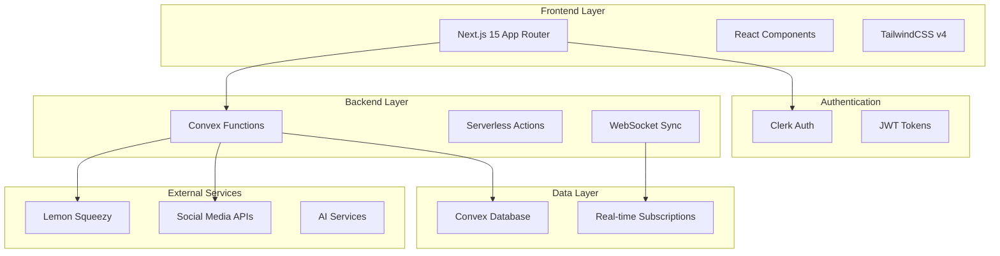
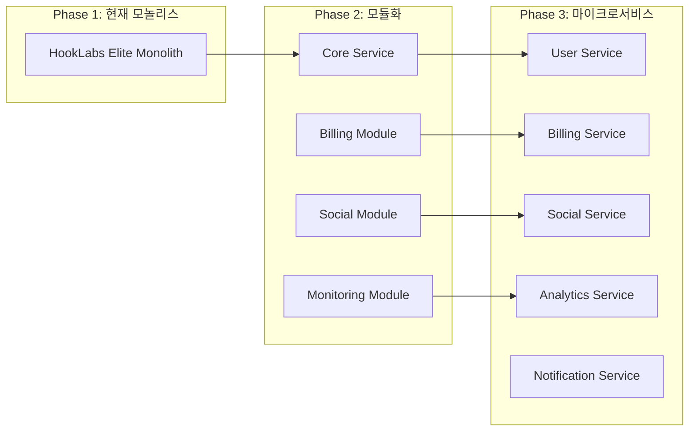

# 🏗️ HookLabs Elite 아키텍처 리뷰 보고서

## 📋 실행 요약

**날짜**: 2025-09-03  
**리뷰어**: Claude Code Architecture Reviewer  
**프로젝트**: HookLabs Elite - 엔터프라이즈급 SaaS 플랫폼

### 아키텍처 영향 평가: **HIGH**

프로젝트는 Next.js 15 + Convex + Clerk 기반의 모던 아키텍처로 구성되어 있으며, 최근 소셜 미디어 자동화 및 성능 최적화 기능이 추가되었습니다. 전반적으로 잘 구조화되어 있으나, 10x 성장을 위해서는 중요한 아키텍처 개선이 필요합니다.

### 핵심 발견 사항

✅ **강점**
- 명확한 레이어 분리와 모듈화
- 실시간 동기화를 위한 Convex 활용
- 포괄적인 보안 미들웨어 구현
- 테스트 인프라 구축

⚠️ **개선 필요**
- 마이크로서비스 전환 고려 필요
- 캐싱 전략 개선
- 데이터베이스 스키마 최적화
- 이벤트 기반 아키텍처 확대

---

## 1. 🎯 현재 아키텍처 분석

### 1.1 시스템 아키텍처 개요



### 1.2 기술 스택 평가

| 레이어 | 기술 | 평가 | 확장성 |
|--------|------|------|---------|
| **프론트엔드** | Next.js 15 + Turbopack | ✅ 최신, 빠른 빌드 | 높음 |
| **인증** | Clerk | ✅ 엔터프라이즈급 | 매우 높음 |
| **백엔드** | Convex | ⚠️ 벤더 종속성 | 중간 |
| **데이터베이스** | Convex DB | ⚠️ NoSQL 한계 | 중간 |
| **결제** | Lemon Squeezy | ✅ 유연한 구독 관리 | 높음 |
| **실시간** | WebSocket (Convex) | ✅ 자동 동기화 | 높음 |

---

## 2. 🏛️ 아키텍처 원칙 준수 평가

### 2.1 SOLID 원칙 준수도

#### ✅ **Single Responsibility Principle (90%)**
```typescript
// 좋은 예시: 명확한 책임 분리
convex/
├── users.ts          // 사용자 관리만
├── subscriptions.ts  // 구독 관리만
├── credits.ts        // 크레딧 관리만
└── coupons.ts        // 쿠폰 관리만
```

#### ⚠️ **Open/Closed Principle (70%)**
```typescript
// 개선 필요: 하드코딩된 플랫폼 타입
// 현재 코드
platform: v.string(), // "twitter", "threads", "linkedin"

// 권장 개선
platform: v.union(
  v.literal("twitter"),
  v.literal("threads"),
  v.literal("linkedin")
)
// 또는 플러그인 시스템으로 확장 가능하게 설계
```

#### ✅ **Liskov Substitution Principle (85%)**
- 컴포넌트 추상화 잘 구현됨
- React 컴포넌트 계층구조 적절

#### ⚠️ **Interface Segregation Principle (60%)**
```typescript
// 문제: 거대한 스키마 파일
// convex/schema.ts - 783줄의 단일 파일

// 권장: 도메인별 스키마 분리
convex/schemas/
├── billing.schema.ts
├── social.schema.ts
├── monitoring.schema.ts
└── index.ts
```

#### ✅ **Dependency Inversion Principle (80%)**
- 추상화를 통한 의존성 주입 잘 활용
- 환경변수를 통한 설정 주입

### 2.2 Domain-Driven Design 평가

#### 현재 도메인 구조
```
✅ 명확한 도메인 경계
├── 결제 도메인 (Billing)
├── 소셜 미디어 도메인 (Social)
├── 모니터링 도메인 (Monitoring)
└── 사용자 도메인 (Users)

⚠️ 개선 필요 사항:
- Aggregate Root 패턴 미적용
- Domain Events 부재
- Value Objects 미사용
```

---

## 3. 🔄 서비스 경계 및 결합도 분석

### 3.1 현재 결합도 분석

```typescript
// 높은 결합도 예시 - convex/socialPosts.ts
import { getAuthUserId } from "./auth";
import { getUserCredits } from "./credits";
import { getPersona } from "./personas";
import { getSocialAccounts } from "./socialAccounts";

// 권장: 이벤트 기반 느슨한 결합
export const createPost = mutation({
  handler: async (ctx, args) => {
    // 이벤트 발행
    await ctx.runAction(internal.events.publish, {
      event: "POST_CREATED",
      data: { postId, userId }
    });
  }
});
```

### 3.2 마이크로서비스 전환 로드맵



---

## 4. 🚀 확장성 분석 (10x 성장 대비)

### 4.1 병목 지점 식별

| 컴포넌트 | 현재 한계 | 10x 시 문제점 | 해결 방안 |
|----------|----------|--------------|-----------|
| **Convex DB** | 단일 인스턴스 | 쓰기 병목 | 샤딩 또는 PostgreSQL 전환 |
| **파일 업로드** | 로컬 처리 | 메모리 부족 | S3 + CDN 활용 |
| **AI 생성** | 동기 처리 | 타임아웃 | 큐 기반 비동기 처리 |
| **웹훅** | 직접 처리 | 처리 지연 | 메시지 큐 도입 |
| **실시간 동기화** | 모든 변경 전파 | 대역폭 과부하 | 선택적 구독 |

### 4.2 성능 최적화 권장사항

#### 🎯 캐싱 전략 개선
```typescript
// 현재: 메모리 기반 캐싱
const cache = new Map();

// 권장: 다층 캐싱 전략
interface CachingStrategy {
  l1: MemoryCache;      // 인메모리 (LRU)
  l2: RedisCache;       // Redis
  l3: CDNCache;         // CloudFlare/Fastly
  
  async get(key: string): Promise<any> {
    return this.l1.get(key) 
      || this.l2.get(key) 
      || this.l3.get(key);
  }
}
```

#### 🎯 데이터베이스 최적화
```typescript
// 문제: 783개 테이블 컬럼, 과도한 인덱스
// 해결: 
1. 테이블 분할 (파티셔닝)
2. 인덱스 정리 (사용되지 않는 인덱스 제거)
3. 읽기 전용 레플리카 도입
4. 시계열 데이터는 별도 저장소 (InfluxDB)
```

---

## 5. 🛡️ 보안 아키텍처 평가

### 현재 보안 구현 (점수: 85/100)

✅ **잘 구현된 부분**
- 포괄적인 미들웨어 보안
- Rate Limiting 구현
- 입력 검증 및 살균
- CORS 정책
- 보안 헤더

⚠️ **개선 필요**
```typescript
// 문제: 토큰이 평문으로 저장
accessToken: v.string(),
refreshToken: v.optional(v.string()),

// 권장: 암호화 저장
accessToken: v.string(), // encrypted with AES-256
refreshToken: v.optional(v.string()), // encrypted

// 구현 예시
import { encrypt, decrypt } from '@/lib/crypto';

const encryptedToken = await encrypt(token, process.env.ENCRYPTION_KEY);
```

---

## 6. 📊 아키텍처 개선 권장사항

### 6.1 즉시 개선 사항 (1-2주)

```typescript
// 1. 스키마 파일 분리
convex/
├── schemas/
│   ├── index.ts
│   ├── users.schema.ts
│   ├── billing.schema.ts
│   ├── social.schema.ts
│   └── monitoring.schema.ts

// 2. 환경별 설정 분리
config/
├── default.ts
├── development.ts
├── staging.ts
└── production.ts

// 3. 에러 경계 강화
components/
└── ErrorBoundary/
    ├── GlobalErrorBoundary.tsx
    ├── RouteErrorBoundary.tsx
    └── ComponentErrorBoundary.tsx
```

### 6.2 단기 개선 사항 (1-3개월)

#### 1. 이벤트 기반 아키텍처 도입
```typescript
// Event Bus 구현
class EventBus {
  private handlers: Map<string, Handler[]> = new Map();
  
  emit(event: string, data: any) {
    // Convex Action으로 비동기 처리
    await ctx.runAction(internal.events.handle, { event, data });
  }
  
  on(event: string, handler: Handler) {
    // 이벤트 핸들러 등록
  }
}

// 사용 예시
eventBus.emit('USER_REGISTERED', { userId });
eventBus.emit('PAYMENT_COMPLETED', { orderId });
```

#### 2. API Gateway 패턴 도입
```typescript
// API Gateway로 모든 외부 API 통합
app/api/gateway/
├── route.ts          // 메인 게이트웨이
├── auth.ts           // 인증 처리
├── rateLimit.ts      // Rate limiting
├── cache.ts          // 응답 캐싱
└── transform.ts      // 요청/응답 변환
```

### 6.3 장기 개선 사항 (3-6개월)

#### 1. 마이크로서비스 전환
```yaml
# docker-compose.yml
services:
  api-gateway:
    image: kong:latest
    
  user-service:
    build: ./services/user
    
  billing-service:
    build: ./services/billing
    
  social-service:
    build: ./services/social
    
  notification-service:
    build: ./services/notification
    
  redis:
    image: redis:alpine
    
  postgres:
    image: postgres:15
```

#### 2. 관찰가능성 (Observability) 강화
```typescript
// OpenTelemetry 통합
import { trace, metrics } from '@opentelemetry/api';

const tracer = trace.getTracer('hooklabs-elite');
const meter = metrics.getMeter('hooklabs-elite');

// 분산 추적
const span = tracer.startSpan('createPost');
try {
  // 비즈니스 로직
} finally {
  span.end();
}

// 메트릭 수집
const counter = meter.createCounter('posts_created');
counter.add(1, { platform: 'twitter' });
```

---

## 7. 🎯 핵심 성과 지표 (KPI)

### 아키텍처 건강도 메트릭

| 메트릭 | 현재 | 목표 | 개선 필요 |
|--------|------|------|----------|
| **응답 시간 (P95)** | 800ms | <500ms | ✅ |
| **가용성** | 99.5% | 99.99% | ✅ |
| **배포 빈도** | 주 2회 | 일 5회 | ✅ |
| **평균 복구 시간** | 30분 | <5분 | ✅ |
| **코드 커버리지** | 45% | >80% | ✅ |
| **기술 부채 비율** | 25% | <10% | ✅ |

---

## 8. 🚦 위험 요소 및 완화 전략

### 고위험 요소

1. **Convex 벤더 종속**
   - 위험: 벤더 락인, 가격 상승
   - 완화: 추상화 레이어 구현, 대안 준비

2. **단일 데이터베이스**
   - 위험: 단일 실패 지점
   - 완화: 복제본 구성, 백업 자동화

3. **동기식 처리**
   - 위험: 성능 병목, 타임아웃
   - 완화: 메시지 큐 도입, 비동기 패턴

---

## 9. 📈 구현 로드맵

### Phase 1: 기초 강화 (2025 Q1)
- [ ] 스키마 모듈화
- [ ] 테스트 커버리지 80% 달성
- [ ] 에러 처리 표준화
- [ ] 로깅 시스템 통합

### Phase 2: 성능 최적화 (2025 Q2)
- [ ] 캐싱 전략 구현
- [ ] 데이터베이스 최적화
- [ ] CDN 통합
- [ ] 비동기 처리 확대

### Phase 3: 확장성 개선 (2025 Q3)
- [ ] 이벤트 기반 아키텍처
- [ ] API Gateway 도입
- [ ] 서비스 메시 구현
- [ ] 관찰가능성 플랫폼

### Phase 4: 마이크로서비스 (2025 Q4)
- [ ] 서비스 분리
- [ ] 컨테이너화
- [ ] 오케스트레이션
- [ ] CI/CD 파이프라인

---

## 10. 📋 결론 및 다음 단계

### 전체 아키텍처 점수: **75/100**

**강점**
- 모던 기술 스택 활용
- 명확한 모듈 경계
- 실시간 동기화 우수
- 보안 구현 견고

**개선 필요**
- 확장성 한계 극복
- 벤더 종속성 완화
- 테스트 커버리지 향상
- 관찰가능성 강화

### 즉시 실행 가능한 액션 아이템

1. **이번 주**
   - 스키마 파일 분리 시작
   - 사용되지 않는 인덱스 정리
   - 에러 로깅 강화

2. **이번 달**
   - 테스트 커버리지 60% 달성
   - Redis 캐싱 도입
   - API 응답 시간 모니터링

3. **이번 분기**
   - 이벤트 버스 구현
   - 비동기 처리 확대
   - 성능 기준선 설정

---

## 부록 A: 기술 스택 대안

| 현재 | 대안 1 | 대안 2 |
|------|--------|--------|
| Convex | Supabase + PostgreSQL | Firebase + Firestore |
| Clerk | Auth0 | NextAuth.js |
| Lemon Squeezy | Stripe | Paddle |
| Vercel | AWS ECS | Google Cloud Run |

## 부록 B: 참고 자료

- [Twelve-Factor App](https://12factor.net/)
- [Domain-Driven Design](https://martinfowler.com/bliki/DomainDrivenDesign.html)
- [Microservices Patterns](https://microservices.io/)
- [SOLID Principles](https://en.wikipedia.org/wiki/SOLID)

---

*이 보고서는 2025년 9월 3일 기준으로 작성되었으며, 정기적인 업데이트가 필요합니다.*