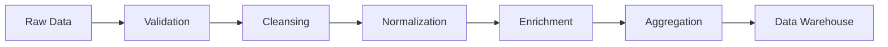

# HookLabs Elite 데이터 파이프라인 아키텍처

## 📊 개요

HookLabs Elite의 소셜 미디어 자동화 플랫폼을 위한 확장 가능한 데이터 파이프라인 아키텍처입니다.

## 🎯 비즈니스 요구사항

### 핵심 데이터 흐름
1. **소셜 미디어 성과 데이터**: Twitter/X, Threads, LinkedIn 등에서 실시간 메트릭 수집
2. **사용자 행동 데이터**: 플랫폼 사용 패턴, 기능 활용도
3. **AI 생성 콘텐츠 분석**: 생성된 콘텐츠의 품질 및 성과 추적
4. **비즈니스 메트릭**: 구독, 크레딧 사용량, 수익 데이터

## 🏗️ 아키텍처 구성

### 1. 데이터 수집 계층 (Ingestion Layer)

#### 1.1 실시간 이벤트 스트림
```typescript
// convex/streaming/eventIngestion.ts
interface EventStream {
  source: 'web' | 'mobile' | 'api' | 'social';
  eventType: string;
  payload: Record<string, any>;
  timestamp: string;
  userId?: string;
  sessionId?: string;
}
```

#### 1.2 배치 데이터 수집
- 소셜 미디어 API 폴링 (15분 간격)
- 일일 비즈니스 메트릭 집계
- 주간/월간 리포트 생성

#### 1.3 데이터 소스
```yaml
sources:
  realtime:
    - user_events: 웹/모바일 사용자 이벤트
    - api_calls: API 호출 로그
    - webhooks: 외부 서비스 웹훅
    
  batch:
    - social_metrics: 소셜 미디어 플랫폼 API
    - billing_data: Lemon Squeezy 결제 데이터
    - ai_usage: Gemini API 사용량
```

### 2. 데이터 변환 계층 (Transformation Layer)

#### 2.1 ETL 파이프라인


#### 2.2 변환 규칙
```typescript
// convex/pipeline/transformations.ts
export const transformationRules = {
  socialMetrics: {
    normalize: (raw: any) => ({
      platform: raw.source,
      postId: raw.id,
      metrics: {
        views: raw.impressions || raw.views || 0,
        likes: raw.likes || raw.favorites || 0,
        shares: raw.retweets || raw.shares || 0,
        comments: raw.replies || raw.comments || 0,
      },
      timestamp: new Date(raw.created_at).toISOString(),
    }),
  },
  
  userEvents: {
    enrich: async (event: any) => ({
      ...event,
      userSegment: await getUserSegment(event.userId),
      deviceInfo: parseUserAgent(event.userAgent),
      geolocation: await getGeolocation(event.ip),
    }),
  },
};
```

### 3. 스트리밍 파이프라인 (Streaming Pipeline)

#### 3.1 실시간 처리 아키텍처
```typescript
// convex/streaming/realtimeProcessor.ts
import { action } from "../_generated/server";
import { v } from "convex/values";

export const processRealtimeEvent = action({
  args: {
    eventType: v.string(),
    payload: v.any(),
  },
  handler: async (ctx, { eventType, payload }) => {
    // 윈도우 집계 (5분, 1시간, 24시간)
    const windows = {
      '5min': 5 * 60 * 1000,
      '1hour': 60 * 60 * 1000,
      '24hour': 24 * 60 * 60 * 1000,
    };
    
    // 이벤트 타입별 처리
    switch (eventType) {
      case 'post_published':
        await processPostPublished(ctx, payload);
        break;
      case 'engagement_received':
        await processEngagement(ctx, payload);
        break;
      case 'credit_consumed':
        await processCreditUsage(ctx, payload);
        break;
    }
    
    // 실시간 대시보드 업데이트
    await updateRealtimeDashboard(ctx, eventType, payload);
  },
});
```

#### 3.2 윈도우 집계 전략
```typescript
// convex/streaming/windowAggregation.ts
export const aggregationWindows = {
  tumbling: {
    // 고정 시간 윈도우
    interval: '5m',
    aggregations: ['count', 'sum', 'avg', 'max', 'min'],
  },
  
  sliding: {
    // 슬라이딩 윈도우
    interval: '1h',
    slide: '5m',
    aggregations: ['moving_avg', 'rate'],
  },
  
  session: {
    // 세션 기반 윈도우
    timeout: '30m',
    maxDuration: '24h',
  },
};
```

### 4. 데이터 저장 전략 (Storage Strategy)

#### 4.1 계층적 저장 구조
```yaml
storage_tiers:
  hot:
    # 최근 7일 데이터
    storage: Convex Database
    access_pattern: 실시간 쿼리
    retention: 7 days
    
  warm:
    # 7-30일 데이터
    storage: PostgreSQL/Supabase
    access_pattern: 분석 쿼리
    retention: 30 days
    
  cold:
    # 30일 이상 데이터
    storage: S3/GCS
    format: Parquet
    compression: Snappy
    retention: 2 years
```

#### 4.2 파티셔닝 전략
```sql
-- PostgreSQL 파티셔닝 예시
CREATE TABLE social_metrics (
    id BIGSERIAL,
    platform VARCHAR(50),
    post_id VARCHAR(255),
    user_id UUID,
    metrics JSONB,
    created_at TIMESTAMP WITH TIME ZONE,
    PRIMARY KEY (id, created_at)
) PARTITION BY RANGE (created_at);

-- 월별 파티션 생성
CREATE TABLE social_metrics_2024_01 
    PARTITION OF social_metrics 
    FOR VALUES FROM ('2024-01-01') TO ('2024-02-01');
```

### 5. 오케스트레이션 (Orchestration)

#### 5.1 Convex Scheduled Functions
```typescript
// convex/crons.ts
import { cronJobs } from "convex/server";
import { internal } from "./_generated/api";

const crons = cronJobs();

// 5분마다 실시간 메트릭 집계
crons.interval(
  "aggregate-realtime-metrics",
  { minutes: 5 },
  internal.pipeline.aggregateRealtimeMetrics
);

// 매시간 소셜 미디어 데이터 동기화
crons.hourly(
  "sync-social-media",
  { minuteUTC: 0 },
  internal.pipeline.syncSocialMediaData
);

// 매일 자정 일일 리포트 생성
crons.daily(
  "daily-report",
  { hourUTC: 0, minuteUTC: 0 },
  internal.pipeline.generateDailyReport
);

// 매월 1일 월간 집계
crons.monthly(
  "monthly-aggregation",
  { day: 1, hourUTC: 0, minuteUTC: 0 },
  internal.pipeline.monthlyAggregation
);

export default crons;
```

#### 5.2 의존성 관리
```typescript
// convex/pipeline/orchestrator.ts
export const pipelineDAG = {
  tasks: {
    fetchSocialData: {
      schedule: '*/15 * * * *', // 15분마다
      dependencies: [],
      retries: 3,
      timeout: '5m',
    },
    
    transformSocialData: {
      trigger: 'on_success:fetchSocialData',
      dependencies: ['fetchSocialData'],
      retries: 2,
      timeout: '10m',
    },
    
    aggregateMetrics: {
      trigger: 'on_success:transformSocialData',
      dependencies: ['transformSocialData'],
      retries: 1,
      timeout: '5m',
    },
    
    updateDashboard: {
      trigger: 'on_success:aggregateMetrics',
      dependencies: ['aggregateMetrics'],
      retries: 1,
      timeout: '2m',
    },
  },
};
```

### 6. 데이터 품질 (Data Quality)

#### 6.1 품질 검증 규칙
```typescript
// convex/pipeline/dataQuality.ts
export const qualityRules = {
  socialMetrics: {
    schema: {
      platform: { type: 'string', required: true, enum: ['twitter', 'threads', 'linkedin'] },
      postId: { type: 'string', required: true, pattern: /^[a-zA-Z0-9_-]+$/ },
      metrics: {
        views: { type: 'number', min: 0 },
        likes: { type: 'number', min: 0 },
        shares: { type: 'number', min: 0 },
      },
      timestamp: { type: 'string', format: 'iso8601' },
    },
    
    businessRules: [
      {
        name: 'engagement_rate_check',
        rule: (data: any) => {
          const engagementRate = (data.likes + data.shares) / data.views;
          return engagementRate <= 1; // 참여율은 100%를 초과할 수 없음
        },
      },
      {
        name: 'timestamp_freshness',
        rule: (data: any) => {
          const age = Date.now() - new Date(data.timestamp).getTime();
          return age < 24 * 60 * 60 * 1000; // 24시간 이내 데이터만 허용
        },
      },
    ],
  },
};
```

#### 6.2 이상치 탐지
```typescript
// convex/pipeline/anomalyDetection.ts
export const anomalyDetection = {
  algorithms: {
    zScore: {
      threshold: 3,
      windowSize: 100,
      metrics: ['views', 'likes', 'shares'],
    },
    
    isolationForest: {
      contamination: 0.1,
      features: ['engagement_rate', 'post_frequency', 'credit_usage'],
    },
    
    prophet: {
      // 시계열 이상치 탐지
      seasonality: 'daily',
      changepoint_prior_scale: 0.05,
    },
  },
  
  alerts: {
    anomaly_detected: {
      severity: 'warning',
      channels: ['slack', 'email'],
      cooldown: '1h',
    },
  },
};
```

### 7. 모니터링 & 알림 (Monitoring & Alerting)

#### 7.1 메트릭 수집
```typescript
// convex/monitoring/metrics.ts
export const pipelineMetrics = {
  throughput: {
    name: 'events_per_second',
    type: 'gauge',
    labels: ['source', 'event_type'],
  },
  
  latency: {
    name: 'processing_duration_ms',
    type: 'histogram',
    buckets: [10, 50, 100, 500, 1000, 5000],
    labels: ['pipeline_stage'],
  },
  
  errors: {
    name: 'pipeline_errors_total',
    type: 'counter',
    labels: ['stage', 'error_type'],
  },
  
  dataQuality: {
    name: 'data_quality_score',
    type: 'gauge',
    labels: ['dataset', 'quality_dimension'],
  },
};
```

#### 7.2 알림 규칙
```typescript
// convex/monitoring/alerts.ts
export const alertRules = [
  {
    name: 'HighErrorRate',
    condition: 'rate(pipeline_errors_total[5m]) > 0.01',
    severity: 'critical',
    message: '파이프라인 오류율이 1%를 초과했습니다',
  },
  {
    name: 'LowThroughput',
    condition: 'events_per_second < 10',
    duration: '5m',
    severity: 'warning',
    message: '이벤트 처리량이 정상 수준 이하입니다',
  },
  {
    name: 'HighLatency',
    condition: 'histogram_quantile(0.95, processing_duration_ms) > 1000',
    severity: 'warning',
    message: 'P95 지연시간이 1초를 초과했습니다',
  },
];
```

### 8. 성능 최적화 (Performance Optimization)

#### 8.1 캐싱 전략
```typescript
// convex/pipeline/caching.ts
export const cachingStrategy = {
  layers: {
    memory: {
      // 인메모리 캐시 (Redis)
      ttl: 300, // 5분
      maxSize: '100MB',
      eviction: 'LRU',
    },
    
    distributed: {
      // 분산 캐시 (Convex)
      ttl: 3600, // 1시간
      invalidation: 'event-based',
    },
    
    static: {
      // 정적 데이터 캐시 (CDN)
      ttl: 86400, // 24시간
      patterns: ['/api/reports/*', '/api/analytics/*'],
    },
  },
};
```

#### 8.2 쿼리 최적화
```typescript
// convex/pipeline/queryOptimization.ts
export const optimizationStrategies = {
  indexing: {
    // 자주 사용되는 쿼리 패턴에 대한 인덱스
    indexes: [
      'social_metrics(user_id, created_at DESC)',
      'user_events(session_id, timestamp)',
      'credits(user_id, type, created_at DESC)',
    ],
  },
  
  materialization: {
    // 사전 계산된 뷰
    views: [
      'daily_user_metrics',
      'hourly_platform_stats',
      'weekly_engagement_summary',
    ],
    refreshInterval: '1h',
  },
  
  partitioning: {
    strategy: 'range',
    column: 'created_at',
    interval: 'monthly',
  },
};
```

## 🚀 구현 로드맵

### Phase 1: 기본 파이프라인 (Week 1-2)
- [x] 실시간 이벤트 수집 설정
- [ ] Convex 스케줄러 구성
- [ ] 기본 데이터 변환 로직
- [ ] 모니터링 대시보드

### Phase 2: 스트리밍 처리 (Week 3-4)
- [ ] 실시간 집계 구현
- [ ] 윈도우 함수 적용
- [ ] 이상치 탐지 시스템
- [ ] 알림 시스템 통합

### Phase 3: 고급 기능 (Week 5-6)
- [ ] 머신러닝 파이프라인
- [ ] 예측 분석 모델
- [ ] A/B 테스트 프레임워크
- [ ] 고급 시각화

### Phase 4: 최적화 (Week 7-8)
- [ ] 성능 튜닝
- [ ] 비용 최적화
- [ ] 확장성 테스트
- [ ] 재해 복구 계획

## 📈 예상 효과

### 비즈니스 영향
- **실시간 인사이트**: 소셜 미디어 성과를 즉시 파악
- **자동화된 최적화**: AI 콘텐츠 생성 개선
- **비용 절감**: 효율적인 리소스 활용
- **확장성**: 사용자 증가에 유연하게 대응

### 기술적 이점
- **데이터 일관성**: 단일 진실 소스 구축
- **낮은 지연시간**: 실시간 처리로 빠른 응답
- **높은 가용성**: 장애 복구 메커니즘
- **관찰가능성**: 완벽한 모니터링 커버리지

## 🔧 기술 스택

### 현재 스택 (Convex 기반)
```yaml
ingestion:
  - Convex HTTP Actions
  - Webhook endpoints
  - Scheduled functions

processing:
  - Convex Actions (Node.js)
  - TypeScript transformations
  
storage:
  - Convex Database (실시간)
  - PostgreSQL/Supabase (분석)
  - S3/R2 (아카이브)
  
monitoring:
  - Sentry (에러 추적)
  - Custom metrics (Convex)
  - Vercel Analytics
```

### 확장 가능한 대안
```yaml
aws:
  - Kinesis Data Streams
  - Lambda Functions
  - Redshift/Athena
  - CloudWatch

gcp:
  - Pub/Sub
  - Cloud Functions
  - BigQuery
  - Cloud Monitoring

azure:
  - Event Hubs
  - Azure Functions
  - Synapse Analytics
  - Application Insights
```

## 📊 성공 지표

### 기술 KPI
- 데이터 지연시간: < 1분
- 처리 성공률: > 99.9%
- 데이터 품질 점수: > 95%
- 시스템 가용성: > 99.95%

### 비즈니스 KPI
- 사용자 인게이지먼트 증가: +30%
- AI 콘텐츠 성과 개선: +25%
- 운영 비용 절감: -20%
- 의사결정 속도: 2배 향상