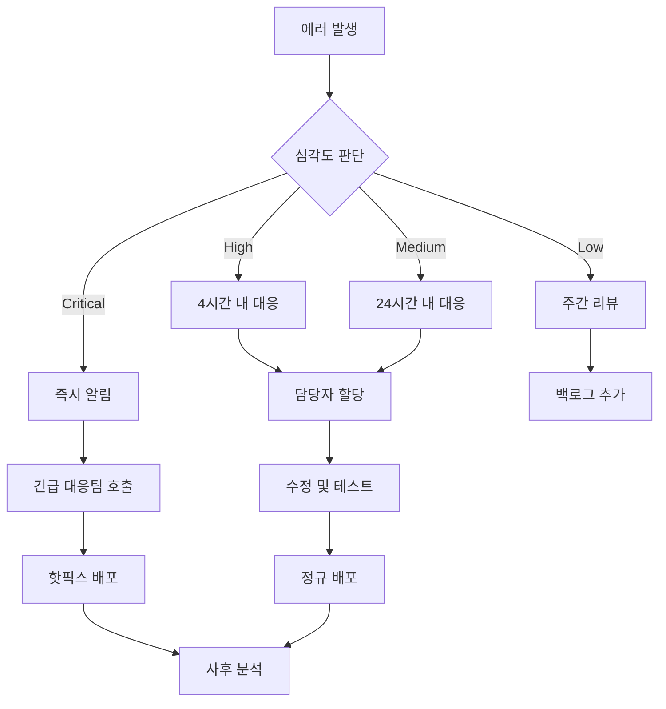

# 📊 모니터링 및 운영 가이드

HookLabs Elite의 포괄적인 모니터링 시스템 운영 가이드입니다.

## 📋 목차

- [모니터링 아키텍처](#모니터링-아키텍처)
- [에러 추적 (Sentry)](#에러-추적-sentry)
- [성능 모니터링](#성능-모니터링)
- [로그 관리](#로그-관리)
- [알림 설정](#알림-설정)
- [대시보드 및 메트릭](#대시보드-및-메트릭)
- [장애 대응](#장애-대응)

## 🏗️ 모니터링 아키텍처

```
┌─────────────────┐    ┌─────────────────┐    ┌─────────────────┐
│   Frontend      │    │    Backend      │    │   External      │
│   Monitoring    │    │   Monitoring    │    │   Services      │
└─────────────────┘    └─────────────────┘    └─────────────────┘
         │                        │                        │
         ▼                        ▼                        ▼
┌─────────────────┐    ┌─────────────────┐    ┌─────────────────┐
│ • Sentry        │    │ • Convex Logs   │    │ • Vercel        │
│ • Web Vitals    │    │ • Health Checks │    │ • Clerk Status  │
│ • User Actions  │    │ • Rate Limiting │    │ • Upstash       │
│ • Performance   │    │ • DB Queries    │    │ • Lemon Squeezy │
└─────────────────┘    └─────────────────┘    └─────────────────┘
         │                        │                        │
         ▼                        ▼                        ▼
┌─────────────────────────────────────────────────────────────────┐
│                    통합 모니터링 대시보드                        │
│ • 실시간 상태 • 알림 • 메트릭 • 트렌드 분석                     │
└─────────────────────────────────────────────────────────────────┘
```

### 주요 모니터링 영역

1. **애플리케이션 성능**: 응답 시간, 처리량, 에러율
2. **사용자 경험**: Core Web Vitals, 사용자 흐름
3. **인프라**: 서버 상태, 데이터베이스 성능
4. **비즈니스 메트릭**: 사용자 등록, 결제 전환율
5. **보안**: 비정상적인 트래픽, 실패한 인증 시도

## 🚨 에러 추적 (Sentry)

### 설정 및 초기화

Sentry는 `lib/monitoring/sentry.ts`에서 자동으로 초기화됩니다.

```typescript
// 자동 초기화 (이미 구현됨)
import { initSentry } from '@/lib/monitoring/sentry'

// 앱 시작 시 호출
initSentry()
```

### 에러 분류

#### 1. 크리티컬 에러 (즉시 대응 필요)

- **결제 처리 실패**
- **인증 시스템 오류**
- **데이터베이스 연결 실패**
- **API 서비스 다운**

#### 2. 중요 에러 (24시간 내 대응)

- **페이지 로드 실패**
- **폼 제출 오류**
- **이미지/파일 업로드 실패**
- **이메일 발송 실패**

#### 3. 일반 에러 (주간 리뷰)

- **UI 컴포넌트 렌더링 오류**
- **네트워크 타임아웃**
- **브라우저 호환성 이슈**

### 에러 대응 프로세스



### 커스텀 에러 추적

```typescript
import { captureError, captureMessage } from '@/lib/monitoring/sentry'

// 에러 추적
try {
  await paymentProcess()
} catch (error) {
  captureError(error, {
    context: 'payment',
    userId: user.id,
    amount: payment.amount
  })
}

// 정보성 메시지
captureMessage('Payment process started', 'info')
```

## 📈 성능 모니터링

### Core Web Vitals 모니터링

자동으로 수집되는 메트릭들:

```typescript
// lib/monitoring/sentry.ts에서 자동 수집
- LCP (Largest Contentful Paint): < 2.5초 목표
- FID (First Input Delay): < 100ms 목표  
- CLS (Cumulative Layout Shift): < 0.1 목표
- TTFB (Time to First Byte): < 600ms 목표
- FCP (First Contentful Paint): < 1.8초 목표
```

### 커스텀 성능 메트릭

```typescript
import analytics from '@/lib/monitoring/analytics'

// API 응답 시간 추적
const startTime = performance.now()
await apiCall()
const duration = performance.now() - startTime

analytics.trackPerformance('API Response Time', duration)

// 사용자 인터랙션 시간
analytics.track('Feature Used', {
  feature: 'subscription',
  response_time: duration
})
```

### 성능 임계값

| 메트릭 | 양호 | 보통 | 개선 필요 |
|--------|------|------|-----------|
| 페이지 로드 | < 2초 | 2-4초 | > 4초 |
| API 응답 | < 200ms | 200-1000ms | > 1초 |
| 데이터베이스 쿼리 | < 100ms | 100-500ms | > 500ms |
| 에러율 | < 0.1% | 0.1-1% | > 1% |

## 📋 로그 관리

### 로그 레벨 및 용도

```typescript
import logger from '@/lib/monitoring/logger'

// DEBUG: 개발 시에만 사용
logger.debug('Variable value', { variable })

// INFO: 일반적인 정보
logger.info('User logged in', { userId: user.id })

// WARN: 주의가 필요한 상황
logger.warn('API rate limit approaching', { usage: '80%' })

// ERROR: 오류 상황
logger.error('Payment failed', error, { userId, amount })
```

### 구조화된 로깅

모든 로그는 JSON 형태로 구조화되어 저장됩니다:

```json
{
  "level": "info",
  "message": "User subscription upgraded",
  "timestamp": "2024-01-15T10:30:00Z",
  "context": {
    "userId": "user_123",
    "planFrom": "basic",
    "planTo": "premium",
    "revenue": 29.99
  },
  "performance": {
    "duration": 1234,
    "memory": 156
  }
}
```

### 로그 보관 정책

- **Error 로그**: 1년 보관
- **Warn 로그**: 6개월 보관  
- **Info 로그**: 3개월 보관
- **Debug 로그**: 1주일 보관 (개발 환경만)

## 🔔 알림 설정

### 알림 채널

1. **Slack**: 개발팀 알림 (#alerts)
2. **Discord**: 운영팀 알림
3. **Email**: 중요 알림
4. **SMS**: 크리티컬 알림 (긴급 상황)

### 알림 규칙

#### 즉시 알림 (Critical)

- **서비스 다운**: Health check 실패
- **에러율 급증**: 5분간 10개 이상 에러
- **결제 실패**: 결제 프로세스 오류
- **보안 이슈**: 비정상적인 로그인 시도

#### 지연 알림 (Warning) - 30분 지연

- **성능 저하**: 응답 시간 2초 초과
- **메모리 사용량**: 80% 이상 사용
- **API 호출 실패**: 특정 외부 서비스 오류

### Slack 알림 설정

```yaml
# .github/workflows/deploy-production.yml에서 설정
- name: Slack Notification
  uses: 8398a7/action-slack@v3
  with:
    status: ${{ job.status }}
    channel: '#deployments'
    text: |
      🚀 프로덕션 배포 ${{ job.status == 'success' && '성공' || '실패' }}
      환경: production
      커밋: ${{ github.sha }}
      작성자: ${{ github.actor }}
```

## 📊 대시보드 및 메트릭

### 실시간 대시보드

#### 1. 운영 대시보드

**URL**: `/admin/dashboard` (관리자 전용)

**주요 메트릭**:
- ✅ 시스템 상태 (Health Status)
- 📊 실시간 사용자 수
- 💰 일일 매출
- 🚨 에러율
- ⚡ 평균 응답 시간

#### 2. 비즈니스 대시보드

**메트릭**:
- 📈 신규 가입자 수
- 💳 구독 전환율
- 🔄 월간 반복 수익 (MRR)
- 👥 활성 사용자 수 (DAU/MAU)
- 📞 고객 지원 티켓 수

### 외부 모니터링 도구

#### Vercel Analytics

- **페이지 뷰**: 실시간 트래픽 모니터링
- **성능 점수**: Core Web Vitals 자동 수집
- **사용자 분석**: 지역별, 디바이스별 분석

#### Sentry Performance

- **트랜잭션 추적**: API 호출 성능 분석
- **에러 추적**: 실시간 에러 모니터링
- **릴리즈 추적**: 버전별 에러율 비교

### 커스텀 메트릭 수집

```typescript
// 비즈니스 메트릭 추적
analytics.track('Subscription Created', {
  plan: 'premium',
  price: 29.99,
  trial_days: 14
})

// 기능 사용량 추적
analytics.trackFeatureUsage('dashboard', 'export_data', {
  export_type: 'csv',
  record_count: 1000
})

// 사용자 여정 추적  
analytics.trackFunnel('signup_process', 'email_verification', {
  user_type: 'organic',
  referrer: 'google'
})
```

## 🚑 장애 대응

### 장애 감지

1. **자동 감지**
   - Health Check API 실패
   - Sentry 에러율 급증 알림
   - 외부 모니터링 서비스 (Pingdom, UptimeRobot)

2. **사용자 신고**
   - 고객 지원 채널을 통한 신고
   - 소셜 미디어 모니터링

### 장애 대응 절차

#### 1단계: 초기 대응 (5분 내)

```bash
# 서비스 상태 확인
curl -f https://hooklabs-elite.com/api/health

# 에러 로그 확인
# Sentry 대시보드에서 최근 에러 확인

# 인프라 상태 확인
# Vercel, Convex, Clerk 상태 페이지 확인
```

#### 2단계: 원인 분석 (15분 내)

1. **로그 분석**
   - 에러 패턴 식별
   - 발생 시점 확인
   - 영향 범위 파악

2. **메트릭 확인**
   - 트래픽 패턴 분석
   - 응답 시간 변화
   - 에러율 추세

#### 3단계: 임시 조치 (30분 내)

- **핫픽스**: 긴급 수정사항 배포
- **롤백**: 이전 안정 버전으로 복구
- **외부 서비스 이슈**: 대체 방안 활성화

#### 4단계: 완전 복구 및 사후 분석

1. **근본 원인 해결**
2. **모니터링 강화**
3. **예방 조치 수립**
4. **Post-mortem 문서 작성**

### 장애 유형별 대응 매뉴얼

#### API 서비스 장애

```bash
# 1. 상태 확인
curl -I https://hooklabs-elite.com/api/health

# 2. Convex 함수 상태 확인
npx convex logs --tail

# 3. 필요시 Convex 재배포
npx convex deploy --prod

# 4. 캐시 무효화
# Redis 캐시 클리어 (필요시)
```

#### 인증 시스템 장애

```bash
# 1. Clerk 상태 확인
curl -I https://api.clerk.dev/v1/health

# 2. JWT 템플릿 확인
# Clerk Dashboard에서 "convex" 템플릿 상태 확인

# 3. 웹훅 상태 확인
# 웹훅 로그에서 실패 이벤트 확인
```

#### 결제 시스템 장애

```bash
# 1. Lemon Squeezy 상태 확인
curl -H "Authorization: Bearer $LEMONSQUEEZY_API_KEY" \
  https://api.lemonsqueezy.com/v1/stores

# 2. 웹훅 처리 상태 확인
# Convex 함수 로그에서 웹훅 처리 오류 확인

# 3. 필요시 결제 처리 대기열 확인
```

### 장애 커뮤니케이션

#### 내부 커뮤니케이션

```markdown
## 🚨 장애 보고서

**발생 시간**: 2024-01-15 14:30 UTC
**영향 범위**: 결제 처리 시스템
**상태**: 조사 중 / 해결 중 / 해결 완료
**예상 복구 시간**: 30분

**현재 상황**:
- Lemon Squeezy API 응답 지연 발생
- 약 15%의 결제 요청이 타임아웃

**대응 조치**:
- [ ] 외부 서비스 상태 확인
- [ ] 재시도 로직 활성화  
- [ ] 고객 지원팀 알림

**담당자**: @developer-team
**다음 업데이트**: 15분 후
```

#### 사용자 커뮤니케이션

```markdown
📢 서비스 상태 안내

안녕하세요, HookLabs Elite 팀입니다.

현재 일부 사용자분들께서 결제 처리 시 지연을 경험하고 계실 수 있습니다. 
저희 팀에서 문제를 인지하고 해결을 위해 작업 중입니다.

**현재 상황**: 결제 처리 지연 (약 30초)
**예상 복구 시간**: 30분 이내
**해결 방법**: 잠시 후 다시 시도해주세요

불편을 끼쳐드려 죄송합니다. 
업데이트 사항은 이 채널을 통해 알려드리겠습니다.

- HookLabs Elite 팀
```

---

## 📈 성능 최적화 가이드

### 정기 점검 항목

#### 주간 점검

- [ ] **Core Web Vitals** 점수 확인
- [ ] **에러율** 트렌드 분석  
- [ ] **API 응답 시간** 평균값 확인
- [ ] **사용자 피드백** 리뷰

#### 월간 점검

- [ ] **번들 크기** 분석 (`npm run build:analyze`)
- [ ] **의존성 업데이트** 검토
- [ ] **데이터베이스 쿼리** 최적화
- [ ] **캐싱 전략** 효과 분석

### 성능 최적화 체크리스트

#### 프론트엔드 최적화

```bash
# 번들 크기 분석
npm run build:analyze

# Lighthouse 성능 측정
npm run lighthouse

# 이미지 최적화 확인
# Next.js Image 컴포넌트 사용률 확인

# 코드 스플리팅 확인  
# 페이지별 번들 크기 분석
```

#### 백엔드 최적화

```typescript
// Convex 함수 성능 모니터링
import { traceDatabaseQuery } from '@/lib/monitoring/sentry'

export const getUsers = query({
  handler: async (ctx) => {
    const transaction = traceDatabaseQuery('select', 'users')
    
    try {
      const users = await ctx.db.query('users').collect()
      return users
    } finally {
      transaction.finish()
    }
  }
})
```

---

이 모니터링 가이드를 따라 안정적이고 고성능의 서비스를 운영하세요. 정기적인 검토와 개선을 통해 사용자 경험을 지속적으로 향상시킬 수 있습니다.