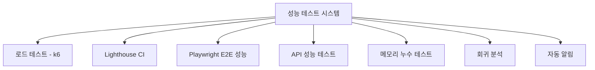

# 🚀 HookLabs Elite 성능 테스트 가이드

HookLabs Elite 소셜 미디어 자동화 플랫폼을 위한 종합적인 성능 테스트 시스템 사용 가이드입니다.

## 📋 목차

1. [시스템 개요](#시스템-개요)
2. [설치 및 설정](#설치-및-설정)
3. [테스트 유형별 실행 방법](#테스트-유형별-실행-방법)
4. [성능 기준 및 목표](#성능-기준-및-목표)
5. [CI/CD 통합](#cicd-통합)
6. [모니터링 및 알림](#모니터링-및-알림)
7. [문제 해결](#문제-해결)

## 🎯 시스템 개요

### 구성 요소



### 테스트 커버리지

- **프론트엔드 성능**: Lighthouse CI를 통한 Core Web Vitals 측정
- **API 성능**: k6 기반 로드 테스트 및 응답시간 측정
- **E2E 시나리오**: Playwright를 통한 실제 사용자 경험 측정
- **메모리 안정성**: 장기간 실행을 통한 메모리 누수 감지
- **성능 회귀**: 기준선 대비 성능 변화 감지
- **스트레스 테스트**: 높은 부하에서의 시스템 안정성 테스트

## 🛠 설치 및 설정

### 1. 의존성 설치

```bash
# 기본 의존성 (이미 설치됨)
npm install

# k6 설치 (Linux/macOS)
sudo apt-key adv --keyserver hkp://keyserver.ubuntu.com:80 --recv-keys C5AD17C747E3415A3642D57D77C6C491D6AC1D69
echo "deb https://dl.k6.io/deb stable main" | sudo tee /etc/apt/sources.list.d/k6.list
sudo apt-get update
sudo apt-get install k6

# k6 설치 (macOS with Homebrew)
brew install k6
```

### 2. 환경 변수 설정

```bash
# .env.local 파일 생성
TEST_BASE_URL=http://localhost:3000
PERFORMANCE_THRESHOLD_FCP=1800
PERFORMANCE_THRESHOLD_LCP=2500
PERFORMANCE_THRESHOLD_CLS=0.1
PERFORMANCE_THRESHOLD_API_RESPONSE=200
SLACK_WEBHOOK_URL=your_slack_webhook_url
ALERT_EMAIL_LIST=your-email@example.com
```

### 3. 성능 기준선 설정

```bash
# 첫 번째 성능 기준선 설정
npm run perf:baseline

# 또는 안정성 검증 없이 빠른 설정
npm run perf:baseline -- --skip-stability
```

## 🧪 테스트 유형별 실행 방법

### 1. 로드 테스트 (k6)

```bash
# 기본 로드 테스트
npm run perf:load

# 스트레스 테스트
npm run perf:stress

# API 전용 테스트
npm run perf:api

# 메모리 누수 테스트 (장시간)
npm run perf:memory
```

**k6 테스트 설정:**
- **로드 테스트**: 최대 200 동시 사용자, 15분 실행
- **스트레스 테스트**: 최대 2000 동시 사용자, 복구 시간 측정
- **API 테스트**: 엔드포인트별 상세 성능 분석

### 2. Lighthouse CI 테스트

```bash
# 기본 Lighthouse 테스트
npm run perf:lighthouse:ci

# 프로파일별 실행
node scripts/lighthouse-performance.js --profile mobile
node scripts/lighthouse-performance.js --profile desktop
```

**측정 메트릭:**
- Performance Score (목표: 90+)
- First Contentful Paint (목표: < 1.8초)
- Largest Contentful Paint (목표: < 2.5초)
- Cumulative Layout Shift (목표: < 0.1)
- Time to Interactive (목표: < 3.9초)

### 3. E2E 성능 테스트

```bash
# E2E 성능 테스트 실행
npm run perf:e2e

# 특정 브라우저에서만 실행
npx playwright test tests/performance/e2e-performance.spec.ts --project=chromium

# 디버그 모드
npx playwright test tests/performance/e2e-performance.spec.ts --debug
```

**테스트 시나리오:**
- 랜딩 페이지 로드 성능
- 대시보드 인터랙션 성능
- 결제 플로우 성능
- 모바일 디바이스 성능
- 네트워크 조건별 성능

### 4. API 성능 테스트

```bash
# API 성능 테스트
npm run test tests/performance/api-performance.test.ts

# 특정 강도로 실행
PERFORMANCE_INTENSITY=heavy npm run test tests/performance/api-performance.test.ts
```

**테스트 엔드포인트:**
- `/api/health`: 기본 응답시간 측정
- `/api/lemonsqueezy/checkout`: 결제 API 성능
- `/api/lemonsqueezy/portal`: 고객 포털 API 성능

### 5. 성능 회귀 분석

```bash
# 회귀 분석 실행
npm run perf:regression

# 새로운 기준선 설정
npm run perf:baseline --force
```

## 📊 성능 기준 및 목표

### Core Web Vitals 기준

| 메트릭 | 우수 | 개선 필요 | 불량 |
|--------|------|-----------|------|
| FCP | < 1.8초 | 1.8-3초 | > 3초 |
| LCP | < 2.5초 | 2.5-4초 | > 4초 |
| FID | < 100ms | 100-300ms | > 300ms |
| CLS | < 0.1 | 0.1-0.25 | > 0.25 |

### API 성능 기준

| 메트릭 | 우수 | 개선 필요 | 불량 |
|--------|------|-----------|------|
| 평균 응답시간 | < 200ms | 200-500ms | > 500ms |
| P95 응답시간 | < 500ms | 500ms-1s | > 1s |
| 오류율 | < 1% | 1-5% | > 5% |
| 처리량 | > 500 RPS | 200-500 RPS | < 200 RPS |

### 시스템 리소스 기준

| 메트릭 | 우수 | 개선 필요 | 불량 |
|--------|------|-----------|------|
| 메모리 사용량 | < 512MB | 512MB-1GB | > 1GB |
| CPU 사용률 | < 70% | 70-90% | > 90% |
| 네트워크 I/O | < 100MB/s | 100-500MB/s | > 500MB/s |

## 🔄 CI/CD 통합

### GitHub Actions 워크플로우

성능 테스트는 다음과 같은 조건에서 자동 실행됩니다:

1. **PR 생성/업데이트**: Lighthouse 테스트만 실행 (가벼운 검증)
2. **main 브랜치 푸시**: 전체 성능 테스트 실행
3. **매일 오전 6시**: 정기 성능 모니터링
4. **수동 실행**: workflow_dispatch로 원하는 테스트 유형 선택

### 워크플로우 실행

```bash
# 수동으로 성능 테스트 실행
gh workflow run performance-tests.yml \
  -f test_type=all \
  -f intensity=normal

# 특정 테스트만 실행
gh workflow run performance-tests.yml \
  -f test_type=lighthouse \
  -f intensity=light
```

### 성능 회귀 감지

- **자동 차단**: 치명적 성능 회귀 감지 시 빌드 실패
- **경고 알림**: 경미한 회귀 시 Slack/이메일 알림
- **PR 코멘트**: Lighthouse 결과를 PR에 자동 코멘트

## 🔔 모니터링 및 알림

### 알림 유형

1. **긴급 알림** (Critical)
   - 애플리케이션 다운
   - 응답시간 2초 초과
   - 오류율 10% 초과
   - 치명적 성능 회귀

2. **경고 알림** (Warning)
   - 성능 회귀 감지
   - Lighthouse 점수 85점 미만
   - API 응답시간 500ms 초과

3. **정보 알림** (Info)
   - 주간 성능 리포트
   - 성능 개선 감지
   - 기준선 업데이트

### 알림 채널

- **Slack**: 실시간 알림 (#performance-alerts, #performance-critical)
- **이메일**: 긴급 문제 시 관리자에게 즉시 알림
- **GitHub Issue**: 심각한 문제 시 자동 이슈 생성
- **PR 코멘트**: Pull Request에 성능 결과 자동 코멘트

### 성능 대시보드

- **실시간 모니터링**: 현재 시스템 상태 및 성능 지표
- **트렌드 분석**: 시간별/일별 성능 변화 추이
- **회귀 히스토리**: 과거 회귀 이슈 및 해결 과정
- **비교 분석**: 브랜치별/커밋별 성능 비교

## 🔧 문제 해결

### 일반적인 문제

#### 1. k6 테스트 실행 실패

```bash
# k6 설치 확인
k6 version

# 애플리케이션이 실행 중인지 확인
curl http://localhost:3000/api/health

# 포트 충돌 확인
netstat -tulpn | grep :3000
```

#### 2. Lighthouse 테스트 실패

```bash
# Chrome/Chromium 설치 확인
google-chrome --version

# 헤드리스 모드에서 실행
CHROME_FLAGS="--no-sandbox --headless" npm run perf:lighthouse:ci

# 로그 확인
DEBUG=lhci:* npm run perf:lighthouse:ci
```

#### 3. Playwright 테스트 실패

```bash
# 브라우저 재설치
npx playwright install

# 특정 브라우저만 설치
npx playwright install chromium

# 의존성 설치
npx playwright install-deps
```

#### 4. 메모리 부족 오류

```bash
# Node.js 힙 크기 증가
NODE_OPTIONS="--max-old-space-size=4096" npm run perf:all

# 시스템 메모리 확인
free -h

# 프로세스 정리
pkill -f node
```

### 성능 최적화 팁

#### 1. 느린 API 응답시간

```typescript
// 응답 시간 최적화
- 데이터베이스 쿼리 최적화
- 캐싱 전략 구현
- CDN 활용
- 불필요한 미들웨어 제거
```

#### 2. 높은 CLS 값

```css
/* 레이아웃 시프트 방지 */
img, iframe {
  width: 100%;
  height: auto;
  aspect-ratio: 16/9; /* 명시적 크기 지정 */
}

.loading-placeholder {
  min-height: 200px; /* 컨텐츠 로딩 전 공간 확보 */
}
```

#### 3. 느린 FCP/LCP

```html
<!-- 리소스 우선순위 최적화 -->
<link rel="preload" href="/fonts/main.woff2" as="font" type="font/woff2" crossorigin>
<link rel="preload" href="/images/hero.webp" as="image">

<!-- 중요 CSS 인라인 -->
<style>
  /* Critical CSS here */
</style>
```

## 📈 리포트 및 분석

### 성능 리포트 위치

- **실시간 리포트**: `/reports/performance/comprehensive-report.html`
- **회귀 분석**: `/reports/performance/regression-report-*.html`
- **Lighthouse 결과**: `/reports/lighthouse/`
- **k6 결과**: k6 실행 후 콘솔 출력

### 리포트 해석

#### Lighthouse 점수 해석

- **90-100점**: 우수 (녹색)
- **50-89점**: 개선 필요 (주황색)
- **0-49점**: 불량 (빨간색)

#### 성능 회귀 판단 기준

- **응답시간 20% 이상 증가**: 회귀로 판단
- **오류율 5% 이상 증가**: 심각한 회귀
- **Lighthouse 점수 10점 이상 감소**: 회귀로 판단
- **Core Web Vitals 임계값 초과**: 회귀로 판단

## 🎯 베스트 프랙티스

### 1. 정기적인 성능 모니터링

```bash
# 매일 성능 체크 설정 (cron)
0 9 * * * cd /path/to/project && npm run perf:regression

# 주간 성능 리포트
0 14 * * 0 cd /path/to/project && npm run perf:report
```

### 2. 성능 기준선 관리

- 새로운 기능 추가 후 기준선 업데이트
- 인프라 변경 후 기준선 재설정
- 정기적인 기준선 검토 (월 1회)

### 3. 테스트 환경 일관성

- 동일한 하드웨어 사양에서 테스트
- 네트워크 조건 일정하게 유지
- 외부 종속성 최소화

### 4. 성능 개선 워크플로우

1. **문제 식별**: 모니터링을 통한 성능 이슈 감지
2. **원인 분석**: 프로파일링 도구를 통한 병목점 파악
3. **해결책 구현**: 최적화 코드 작성
4. **성능 테스트**: 개선 효과 검증
5. **기준선 업데이트**: 새로운 성능 수준 반영

## 🆘 지원 및 문의

- **GitHub Issues**: 버그 리포트 및 기능 요청
- **Slack**: #performance-support 채널
- **문서**: `/docs/performance-testing-guide.md`
- **예제**: `/tests/performance/` 디렉토리

---

**⚡ 성능은 기능입니다!** 사용자 경험을 위해 지속적인 성능 모니터링과 최적화를 실시하세요.