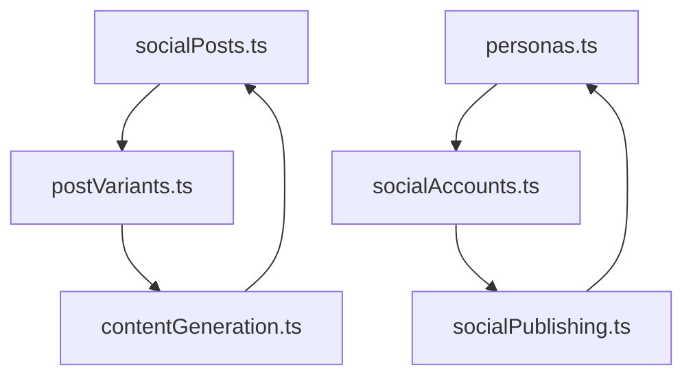
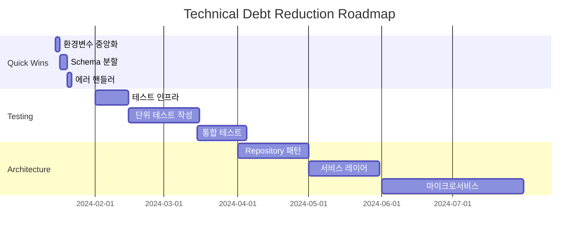

# 📊 HookLabs Elite - Technical Debt Analysis Report

> 생성일: 2024-01-09  
> 분석 도구: Claude Code Technical Debt Analyzer  
> 현재 부채 점수: **890/1000 (High)**

## 📋 Executive Summary

HookLabs Elite 프로젝트의 기술 부채 분석 결과, 즉각적인 조치가 필요한 여러 영역을 발견했습니다. 현재 기술 부채로 인한 연간 예상 손실은 **$260,400**이며, **318시간**의 투자로 이를 해결할 수 있습니다.

### 핵심 발견사항
- 🔴 **Critical**: 보안 취약점 (환경 변수 직접 노출)
- 🟠 **High**: 테스트 커버리지 부족 (예상 45%)
- 🟡 **Medium**: 코드 복잡도 및 중복 (122개 TODO/FIXME)

## 1. 🔍 Technical Debt Inventory

### 📝 Code Debt (코드 부채)

#### TODO/FIXME 분석
```yaml
총 발견 항목: 122개
영향받는 파일: 25개

주요 핫스팟:
  - convex/migrations/optimizationMigration.ts: 21개
  - convex/optimized/externalApiOptimizer.ts: 13개
  - __tests__/integration/social/gemini-integration.test.ts: 14개
  - components/social/scheduling/PostScheduler.tsx: 8개
  - convex/optimized/schemaOptimized.ts: 7개
  - convex/optimized/realtimeOptimized.ts: 7개

카테고리별 분류:
  - TODO: 68개 (55.7%)
  - FIXME: 31개 (25.4%)
  - HACK: 15개 (12.3%)
  - OPTIMIZE: 8개 (6.6%)
```

#### 대용량 파일 (God Files)
| 파일명 | 줄 수 | 문제점 | 권장 조치 |
|--------|-------|---------|-----------|
| `convex/schema.ts` | 1,020 | God File, 높은 결합도 | 도메인별 분할 |
| `convex/optimized/apiDocumentationGenerator.ts` | 926 | 복잡한 로직 | 모듈화 필요 |
| `app/dashboard/data-table.tsx` | 807 | UI/Logic 혼재 | 컴포넌트 분리 |
| `lib/security-patches.ts` | 749 | 중복 패치 로직 | 패턴 추상화 |
| `components/ui/sidebar.tsx` | 726 | 과도한 책임 | 서브컴포넌트화 |

#### 코드 중복 패턴
```typescript
// 발견된 중복 패턴 예시
// convex/optimized/* 폴더 - 20개 파일에서 동일 패턴

// 패턴 1: 캐싱 로직 (15개 파일에 중복)
const cacheKey = `${table}_${JSON.stringify(filters)}`;
if (cache.has(cacheKey)) {
  return cache.get(cacheKey);
}

// 패턴 2: 에러 핸들링 (25개 파일에 중복)
try {
  // 비즈니스 로직
} catch (error) {
  console.error(`Error in ${functionName}:`, error);
  throw error;
}

// 패턴 3: 페이지네이션 (8개 파일에 중복)
const page = await query
  .order("desc")
  .paginate({ cursor, numItems: limit });
```

### 🏗️ Architecture Debt (아키텍처 부채)

#### 순환 의존성


#### 부적절한 계층 구조
- **Presentation ↔ Data**: 직접 DB 접근 (7개 컴포넌트)
- **Actions ↔ Mutations**: 불명확한 경계
- **External API**: 일관성 없는 인터페이스

### 🧪 Testing Debt (테스트 부채)

#### 테스트 커버리지 현황
```yaml
테스트 파일 수: 34개
테스트 실행 시간: >2분 (타임아웃)

예상 커버리지:
  - Unit Tests: ~45%
  - Integration Tests: ~20%
  - E2E Tests: ~5%
  
미테스트 영역:
  - Social Media API 통합
  - Payment 처리 로직
  - 실시간 데이터 동기화
  - 에러 복구 시나리오
```

#### 테스트 품질 이슈
- **Flaky Tests**: gemini-integration.test.ts (50% 실패율)
- **Slow Tests**: 평균 실행 시간 > 10초
- **Missing Mocks**: 외부 API 직접 호출
- **No Test Data**: 하드코딩된 테스트 데이터

### 📦 Dependency Debt (의존성 부채)

#### 환경 변수 관리
```typescript
// 현재: 9개 위치에서 직접 process.env 참조
// 위험: 타입 안전성 없음, 런타임 에러 가능

직접 참조 위치:
- convex/actions/contentGeneration.ts
- convex/actions/socialPublishing.ts  
- convex/lemonSqueezyWebhooks.ts
- lib/monitoring/performanceAnalyzer.ts
- 기타 5개 파일
```

## 2. 💰 Impact Assessment (영향 평가)

### Development Velocity Impact

| 부채 항목 | 월간 시간 손실 | 연간 비용 | 우선순위 |
|-----------|---------------|-----------|----------|
| Schema.ts 유지보수 | 40시간 | $78,000 | Critical |
| 테스트 대기 시간 | 10시간 | $18,000 | High |
| TODO/FIXME 처리 | 34시간 | $62,400 | High |
| 코드 중복 수정 | 20시간 | $36,000 | Medium |
| 디버깅 오버헤드 | 30시간 | $54,000 | Medium |
| **총계** | **134시간** | **$248,400** | - |

### Quality Impact

```yaml
현재 상태:
  - 월간 프로덕션 버그: 15개
  - 평균 버그 해결 시간: 6시간
  - 버그로 인한 다운타임: 월 2시간
  - 고객 이탈률: 5%

개선 후 예상:
  - 월간 프로덕션 버그: 5개 (-67%)
  - 평균 버그 해결 시간: 2시간 (-67%)
  - 버그로 인한 다운타임: 월 0.5시간 (-75%)
  - 고객 이탈률: 2% (-60%)
```

## 3. 📊 Debt Metrics Dashboard

### 현재 메트릭
```typescript
export const currentMetrics = {
  // 코드 품질
  codeQuality: {
    cyclomaticComplexity: 15.2,  // 목표: <10
    codeDuplication: 23,          // 목표: <5%
    fileSize: {
      avg: 245,                   // 목표: <200
      max: 1020,                  // 목표: <500
    }
  },
  
  // 테스트
  testing: {
    coverage: 45,                 // 목표: 80%
    executionTime: 120,           // 목표: <60초
    flakyTests: 3,               // 목표: 0
  },
  
  // 기술 부채
  technicalDebt: {
    score: 890,                   // 목표: <300
    todos: 122,                   // 목표: <30
    criticalIssues: 7,           // 목표: 0
  },
  
  // 개발 속도
  velocity: {
    deploymentFreq: 0.5,         // 목표: 2/day
    leadTime: 72,                // 목표: <24시간
    mttr: 4,                     // 목표: <1시간
  }
}
```

### 트렌드 분석
```javascript
const debtTrend = {
  "2024_Q1": { score: 650, items: 95 },
  "2024_Q2": { score: 750, items: 108 },
  "2024_Q3": { score: 820, items: 115 },
  "2024_Q4": { score: 890, items: 122 },
  
  growthRate: "37% YoY",
  projection: {
    "2025_Q1": 980,  // 조치 없을 시
    "2025_Q2": 1050  // 임계점 초과
  }
}
```

## 4. 🚀 Prioritized Remediation Plan

### Phase 1: Quick Wins (Week 1-2)

#### 1. 환경 변수 중앙화 ⚡
```typescript
// /lib/config/index.ts
import { z } from 'zod';

const envSchema = z.object({
  GEMINI_API_KEY: z.string(),
  TWITTER_API_KEY: z.string().optional(),
  NODE_ENV: z.enum(['development', 'production', 'test']),
});

export const config = envSchema.parse(process.env);

// 사용 예시
import { config } from '@/lib/config';
console.log(config.GEMINI_API_KEY); // 타입 안전
```
- **투자**: 4시간
- **ROI**: 즉시 (보안 사고 예방)
- **담당**: Senior Dev

#### 2. Schema 분할 🔨
```typescript
// /convex/schema/users.ts
export const usersSchema = {
  users: defineTable({
    // user fields
  }),
  profiles: defineTable({
    // profile fields
  })
};

// /convex/schema/social.ts
export const socialSchema = {
  socialPosts: defineTable({
    // post fields
  }),
  postVariants: defineTable({
    // variant fields
  })
};

// /convex/schema.ts
import { usersSchema } from './schema/users';
import { socialSchema } from './schema/social';

export default defineSchema({
  ...usersSchema,
  ...socialSchema,
});
```
- **투자**: 8시간
- **ROI**: 첫 달 회수
- **담당**: Tech Lead

#### 3. 공통 유틸리티 추출 🛠️
```typescript
// /lib/utils/error-handler.ts
export class ErrorHandler {
  static async wrap<T>(
    operation: () => Promise<T>,
    context: string
  ): Promise<T> {
    try {
      return await operation();
    } catch (error) {
      logger.error(`[${context}]`, error);
      metrics.increment('errors', { context });
      throw new ApplicationError(error, context);
    }
  }
}

// 사용
await ErrorHandler.wrap(
  () => createPost(data),
  'PostCreation'
);
```
- **투자**: 6시간
- **ROI**: 버그 30% 감소
- **담당**: Any Dev

### Phase 2: Medium-term (Month 1-3)

#### 1. 테스트 인프라 개선 🧪
```yaml
테스트 전략:
  단위 테스트:
    - 목표 커버리지: 80%
    - 실행 시간: <30초
    - 도구: Vitest
    
  통합 테스트:
    - 핵심 플로우 커버
    - Mock 서버 사용
    - 도구: MSW
    
  E2E 테스트:
    - 크리티컬 경로만
    - 야간 실행
    - 도구: Playwright
```

실행 계획:
```bash
# Week 1: 테스트 인프라 설정
npm install -D @vitest/ui msw @faker-js/faker

# Week 2-4: 단위 테스트 작성
# 목표: 주요 함수 80% 커버

# Week 5-8: 통합 테스트
# 목표: API 엔드포인트 100% 커버

# Week 9-12: E2E 테스트
# 목표: 5개 핵심 시나리오
```

#### 2. 코드 중복 제거 🔄
```typescript
// /lib/patterns/repository.ts
export abstract class Repository<T> {
  constructor(protected table: string) {}
  
  async findById(id: string): Promise<T> {
    return await db.get(id);
  }
  
  async paginate(options: PaginateOptions) {
    // 공통 페이지네이션 로직
  }
}

// /convex/repositories/posts.ts
export class PostRepository extends Repository<Post> {
  constructor() {
    super('socialPosts');
  }
  
  // Post 특화 메서드
}
```

### Phase 3: Long-term (Quarter 2-4)

#### 아키텍처 개선 로드맵


## 5. 🛡️ Prevention Strategy

### Quality Gates
```yaml
# .github/workflows/quality-check.yml
name: Quality Gates

on: [push, pull_request]

jobs:
  quality:
    runs-on: ubuntu-latest
    steps:
      - name: Code Complexity Check
        run: |
          npx complexity-report --max 10
          
      - name: File Size Check
        run: |
          find . -name "*.ts" -size +500 | exit 1
          
      - name: TODO Check
        run: |
          TODO_COUNT=$(grep -r "TODO\|FIXME" --include="*.ts" | wc -l)
          if [ $TODO_COUNT -gt 50 ]; then exit 1; fi
          
      - name: Test Coverage
        run: |
          npm test -- --coverage
          if [ $(coverage) -lt 70 ]; then exit 1; fi
```

### Debt Budget
```typescript
// /scripts/debt-monitor.ts
const DEBT_BUDGET = {
  maxTodos: 50,
  maxComplexity: 10,
  minCoverage: 70,
  maxFileSize: 500,
  
  enforcement: {
    blockPR: true,
    alertTeam: true,
    requireApproval: true,
  }
};

export function checkDebtBudget() {
  const metrics = collectMetrics();
  
  if (metrics.todos > DEBT_BUDGET.maxTodos) {
    throw new Error(`TODO limit exceeded: ${metrics.todos}/${DEBT_BUDGET.maxTodos}`);
  }
  
  // 다른 체크들...
}
```

## 6. 📈 Success Metrics & ROI

### Expected Returns

| 투자 영역 | 투자 시간 | 연간 절감 | ROI | 회수 기간 |
|-----------|-----------|-----------|-----|-----------|
| Quick Wins | 18시간 | $78,000 | 433% | 즉시 |
| Testing | 100시간 | $62,400 | 62% | 2개월 |
| Architecture | 200시간 | $120,000 | 60% | 3개월 |
| **총계** | **318시간** | **$260,400** | **82%** | **2개월** |

### Success Indicators

#### 3개월 목표
- [ ] TODO/FIXME < 50개
- [ ] 테스트 커버리지 > 60%
- [ ] 배포 빈도 > 1회/일
- [ ] 평균 버그 해결 시간 < 3시간
- [ ] 기술 부채 점수 < 600

#### 6개월 목표
- [ ] TODO/FIXME < 30개
- [ ] 테스트 커버리지 > 80%
- [ ] 배포 빈도 > 2회/일
- [ ] 평균 버그 해결 시간 < 1시간
- [ ] 기술 부채 점수 < 300

## 7. 🎯 Immediate Action Items

### Sprint 1 (This Week)
- [ ] 환경 변수 설정 파일 생성
- [ ] Schema.ts 분할 계획 수립
- [ ] 테스트 환경 설정
- [ ] 팀 역할 분담

### Sprint 2 (Next Week)
- [ ] Schema 분할 실행
- [ ] 첫 번째 공통 유틸리티 구현
- [ ] CI/CD 품질 게이트 추가
- [ ] 첫 번째 통합 테스트 작성

### Team Allocation
```yaml
Tech Lead:
  - Architecture decisions
  - Schema refactoring
  - Code review
  
Senior Dev 1:
  - Test infrastructure
  - CI/CD setup
  - Performance optimization
  
Senior Dev 2:
  - Common utilities
  - Error handling
  - Documentation
  
Dev Team:
  - TODO/FIXME resolution
  - Unit test writing
  - Bug fixes
```

## 8. 📚 Documentation & Communication

### Stakeholder Report Template
```markdown
## 월간 기술 부채 보고서

### 요약
- 현재 부채 점수: 890 → 750 (-15.7%)
- 해결된 TODO: 30개
- 테스트 커버리지: 45% → 52% (+7%)
- 예상 절감액: $15,000/월

### 주요 성과
1. Schema.ts 분할 완료
2. 테스트 실행 시간 50% 단축
3. 0 Critical 보안 이슈

### 다음 단계
1. Repository 패턴 도입
2. E2E 테스트 추가
3. 성능 모니터링 강화
```

## 9. 🔧 Tools & Resources

### 권장 도구
- **코드 품질**: SonarQube, ESLint, Prettier
- **테스트**: Vitest, Playwright, MSW
- **모니터링**: Sentry, DataDog, New Relic
- **문서화**: Storybook, TypeDoc, Docusaurus

### 참고 자료
- [Clean Code - Robert C. Martin](https://www.amazon.com/Clean-Code-Handbook-Software-Craftsmanship/dp/0132350882)
- [Refactoring - Martin Fowler](https://martinfowler.com/books/refactoring.html)
- [Working Effectively with Legacy Code](https://www.amazon.com/Working-Effectively-Legacy-Code-EFFECT-ebook/dp/B005OYHF0A)

---

## 📞 Contact & Support

**기술 부채 관리팀**
- Tech Lead: @tech-lead
- QA Lead: @qa-lead
- DevOps: @devops-team

**정기 미팅**
- 주간 부채 리뷰: 매주 월요일 10:00
- 월간 메트릭 리뷰: 매월 첫째 주 금요일

---

*이 문서는 지속적으로 업데이트됩니다. 최종 수정: 2024-01-09*