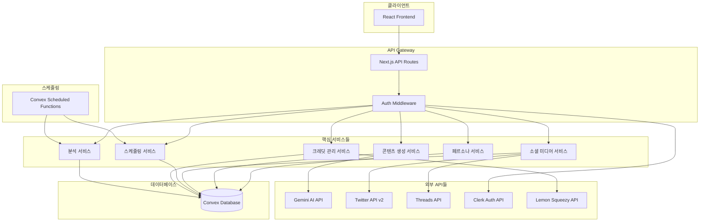

# 트위터/쓰레드 자동 발행 SaaS - 백엔드 아키텍처 설계

## 1. 시스템 아키텍처 개요



## 2. 서비스 경계 정의

### 2.1 페르소나 서비스 (Persona Service)
**책임:**
- 사용자 페르소나 CRUD 관리
- 페르소나 템플릿 관리
- 페르소나별 프롬프트 최적화

**데이터:**
- personas 테이블
- 페르소나 템플릿 데이터

**API 엔드포인트:**
```typescript
// Convex 쿼리
GET /api/convex/personas/list
GET /api/convex/personas/get/{id}

// Convex 뮤테이션
POST /api/convex/personas/create
PUT /api/convex/personas/update/{id}
DELETE /api/convex/personas/delete/{id}
```

### 2.2 콘텐츠 생성 서비스 (Content Generation Service)
**책임:**
- AI 기반 콘텐츠 생성
- 변형 버전 생성 (variants)
- 콘텐츠 점수화 및 최적화
- 프롬프트 엔지니어링

**데이터:**
- socialPosts, postVariants, aiGenerations 테이블

**외부 의존성:**
- Gemini API

**API 엔드포인트:**
```typescript
// Convex 액션 (외부 API 호출)
POST /api/convex/content/generate-variants
POST /api/convex/content/optimize-content
POST /api/convex/content/analyze-content

// Convex 쿼리
GET /api/convex/content/posts/{userId}
GET /api/convex/content/variants/{postId}
```

### 2.3 소셜 미디어 서비스 (Social Media Service)
**책임:**
- 소셜 계정 OAuth 연동
- 게시물 발행
- 메트릭 수집
- 토큰 관리 및 갱신

**데이터:**
- socialAccounts, scheduledPosts 테이블

**외부 의존성:**
- Twitter API v2, Threads API

**API 엔드포인트:**
```typescript
// OAuth 연동
GET /api/social/auth/{platform}/callback
POST /api/social/accounts/connect
DELETE /api/social/accounts/disconnect/{accountId}

// 게시물 발행
POST /api/social/publish/immediate
POST /api/social/publish/schedule
GET /api/social/posts/{postId}/metrics
```

### 2.4 스케줄링 서비스 (Scheduling Service)
**책임:**
- 게시물 예약 관리
- 최적 시간 추천
- 실패한 게시물 재시도
- Cron 작업 관리

**데이터:**
- scheduledPosts 테이블

**API 엔드포인트:**
```typescript
// 스케줄링 관리
GET /api/convex/schedule/calendar/{userId}
POST /api/convex/schedule/create
PUT /api/convex/schedule/update/{scheduleId}
DELETE /api/convex/schedule/cancel/{scheduleId}

// 최적화
POST /api/convex/schedule/suggest-times
GET /api/convex/schedule/performance-insights
```

### 2.5 크레딧 관리 서비스 (Credit Management Service)
**책임:**
- 크레딧 소모 추적
- 구독 플랜 관리
- 사용량 제한 체크
- 결제 처리

**데이터:**
- credits, userCreditBalances 테이블 (기존)
- subscriptions 테이블과 연동

**외부 의존성:**
- Lemon Squeezy API

**API 엔드포인트:**
```typescript
// 크레딧 관리
GET /api/convex/credits/balance/{userId}
POST /api/convex/credits/deduct
GET /api/convex/credits/history/{userId}

// 구독 관리 (기존 시스템 확장)
POST /api/lemonsqueezy/subscription/upgrade
GET /api/lemonsqueezy/subscription/usage
```

### 2.6 분석 서비스 (Analytics Service)
**책임:**
- 게시물 성과 분석
- 트렌드 분석
- 경쟁사 비교
- 최적화 제안

**데이터:**
- postAnalytics 테이블

**API 엔드포인트:**
```typescript
// 분석 데이터
GET /api/convex/analytics/dashboard/{userId}
GET /api/convex/analytics/posts/{postId}
GET /api/convex/analytics/trends/{userId}
POST /api/convex/analytics/generate-insights
```

## 3. RESTful API 설계

### 3.1 API 명명 규칙
- **Convex 함수**: `/api/convex/{service}/{action}`
- **외부 연동**: `/api/{service}/{resource}/{action}`
- **버전 관리**: `/api/v1/...` (필요시)

### 3.2 표준 응답 형식
```typescript
// 성공 응답
interface SuccessResponse<T> {
  success: true;
  data: T;
  metadata?: {
    totalCount?: number;
    pageSize?: number;
    currentPage?: number;
    creditsUsed?: number;
  };
}

// 에러 응답
interface ErrorResponse {
  success: false;
  error: {
    code: string;
    message: string;
    details?: any;
  };
}
```

### 3.3 핵심 API 예시

#### 페르소나 관리
```typescript
// GET /api/convex/personas/list?userId={userId}
{
  "success": true,
  "data": [
    {
      "_id": "persona_123",
      "userId": "user_456",
      "name": "SaaS 창업자",
      "role": "창업가",
      "tone": "전문적",
      "interests": ["SaaS", "스타트업", "마케팅"],
      "expertise": ["제품 개발", "비즈니스 전략"],
      "isActive": true,
      "createdAt": "2024-01-01T00:00:00Z"
    }
  ]
}

// POST /api/convex/personas/create
{
  "name": "개발자 인플루언서",
  "role": "개발자",
  "tone": "친근한",
  "interests": ["JavaScript", "React", "AI"],
  "expertise": ["웹 개발", "프론트엔드"],
  "description": "개발자들에게 유용한 팁을 공유하는 페르소나"
}
```

#### 콘텐츠 생성
```typescript
// POST /api/convex/content/generate-variants
{
  "originalContent": "AI 도구를 활용한 개발 생산성 향상에 대한 글을 쓰려고 해",
  "personaId": "persona_123",
  "platforms": ["twitter", "threads"],
  "variantCount": 5
}

// 응답
{
  "success": true,
  "data": {
    "postId": "post_789",
    "variants": [
      {
        "_id": "variant_001",
        "content": "🚀 AI 도구로 개발 생산성을 2배 높이는 방법\n\n1. GitHub Copilot으로 코드 자동완성\n2. ChatGPT로 문서화 작성\n3. Claude로 코드 리뷰\n\n어떤 도구를 가장 많이 사용하시나요?",
        "overallScore": 87,
        "scoreBreakdown": {
          "engagement": 85,
          "virality": 80,
          "personaMatch": 92,
          "readability": 88,
          "trending": 85
        }
      }
    ]
  },
  "metadata": {
    "creditsUsed": 10
  }
}
```

#### 스케줄링
```typescript
// POST /api/convex/schedule/create
{
  "postId": "post_789",
  "variantId": "variant_001",
  "platforms": ["twitter", "threads"],
  "scheduledFor": "2024-01-15T10:00:00Z",
  "socialAccountIds": ["account_111", "account_222"]
}

// GET /api/convex/schedule/calendar/{userId}?start=2024-01-01&end=2024-01-31
{
  "success": true,
  "data": [
    {
      "_id": "schedule_456",
      "postId": "post_789",
      "platform": "twitter",
      "scheduledFor": "2024-01-15T10:00:00Z",
      "status": "pending",
      "content": "🚀 AI 도구로 개발 생산성을...",
      "personaName": "SaaS 창업자"
    }
  ]
}
```

## 4. 실시간 데이터 동기화

### 4.1 Convex 실시간 구독
```typescript
// 게시물 상태 실시간 업데이트
const scheduledPosts = useQuery(api.schedule.getScheduledPosts, { 
  userId: user.id,
  status: "pending"
});

// 크레딧 잔액 실시간 업데이트
const creditBalance = useQuery(api.credits.getUserBalance, { 
  userId: user.id 
});

// 게시물 메트릭 실시간 업데이트
const postMetrics = useQuery(api.analytics.getPostMetrics, { 
  postId: "post_123" 
});
```

### 4.2 상태 관리
- **Convex**에서 자동으로 실시간 상태 동기화
- 클라이언트에서는 `useQuery`, `useMutation` 훅 사용
- 낙관적 업데이트로 UX 향상

## 5. 에러 처리 및 복원력

### 5.1 에러 분류
```typescript
enum ErrorCodes {
  // 인증/권한
  UNAUTHORIZED = 'UNAUTHORIZED',
  INSUFFICIENT_CREDITS = 'INSUFFICIENT_CREDITS',
  
  // 외부 API
  GEMINI_API_ERROR = 'GEMINI_API_ERROR',
  TWITTER_API_ERROR = 'TWITTER_API_ERROR',
  THREADS_API_ERROR = 'THREADS_API_ERROR',
  
  // 비즈니스 로직
  PERSONA_NOT_FOUND = 'PERSONA_NOT_FOUND',
  INVALID_CONTENT = 'INVALID_CONTENT',
  SCHEDULING_CONFLICT = 'SCHEDULING_CONFLICT',
  
  // 시스템
  DATABASE_ERROR = 'DATABASE_ERROR',
  RATE_LIMIT_EXCEEDED = 'RATE_LIMIT_EXCEEDED'
}
```

### 5.2 재시도 전략
```typescript
// 스케줄링된 게시물 재시도 로직
const retryScheduledPost = {
  maxRetries: 3,
  backoffStrategy: 'exponential', // 1분, 5분, 15분
  retryableErrors: [
    'TWITTER_API_ERROR',
    'THREADS_API_ERROR',
    'RATE_LIMIT_EXCEEDED'
  ]
};
```

## 6. 성능 최적화

### 6.1 캐싱 전략
- **Convex 쿼리**: 자동 캐싱 및 무효화
- **외부 API**: Redis 캐싱 (필요시)
- **정적 데이터**: CDN 캐싱 (이미지, 템플릿)

### 6.2 배치 처리
- 여러 플랫폼 동시 발행
- 메트릭 수집 배치 작업
- 크레딧 집계 배치 처리

### 6.3 Rate Limiting
```typescript
// 사용자별 요청 제한
const rateLimits = {
  contentGeneration: '10/minute',
  postPublishing: '50/hour',
  apiCalls: '1000/day'
};
```

## 7. 모니터링 및 로깅

### 7.1 핵심 메트릭
- API 응답 시간
- 외부 API 성공률
- 크레딧 사용량
- 게시물 발행 성공률
- 사용자 활성도

### 7.2 로깅 전략
- 구조화된 JSON 로깅
- 사용자별 액션 추적
- 에러 스택 트레이스
- 외부 API 요청/응답 로깅

이 아키텍처는 확장 가능하고 유지보수가 쉬우며, 각 서비스가 명확한 책임을 가지도록 설계되었습니다. Convex의 실시간 기능을 활용하여 사용자에게 즉각적인 피드백을 제공하고, 외부 API 통합을 통해 강력한 기능을 제공합니다.